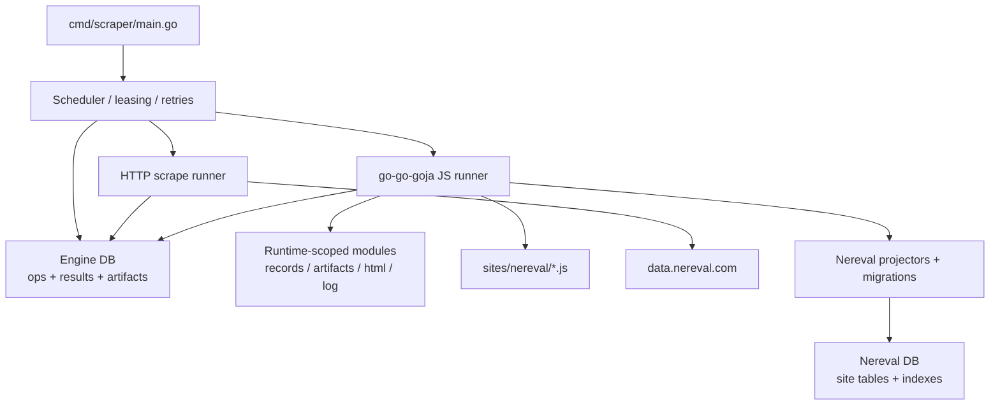

# Generic Go scraper engine and nereval port design guide

## Executive Summary

The imported [scraper sketch](../sources/local/scraper.md) proposes a durable async execution engine, not a one-off crawler. That matches the direction the current `nereval/` prototype was already moving toward, but only implicitly. The existing prototype already proves five useful primitives: HTTP fetch with ASP.NET form-state handling, deterministic DOM extraction, persistent SQLite storage, resumable detail work via a queue, and rate-limited orchestration. Those pieces live in hard-coded JavaScript modules today, but they are recognizable precursors to a generic engine.

The right port is therefore not "rewrite `nereval/run.js` in Go line by line." The right port is to extract the stable engine concerns out of the prototype and make them first-class:

- durable ops instead of ad hoc phases,
- queue and lease semantics instead of a site-specific `detail_queue`,
- artifacts and records instead of direct writes from every callsite,
- embedded JavaScript as a programmable layer on top of a Go runtime,
- site-specific scripts and helpers for NEREVAL instead of hard-coding all behavior in `worker.js` and `extract.js`.

The imported design already gives a strong envelope for this. It describes persisted ops, persisted results, queue-based rate limiting, dependency-aware scheduling, and JS-driven fan-out in [sources/local/scraper.md](../sources/local/scraper.md). The current `nereval/` prototype proves that those abstractions are not speculative. `fetch.js` already models site-specific acquisition constraints such as `__VIEWSTATE` and proxy-aware retries, `extract.js` already models pure page-to-data transforms, `db.js` already stores both domain data and operational state, and `worker.js` already executes a two-phase graph even though it does not yet name it that way.

The recommended implementation for `scraper/` is a design-first, Go-first runtime with the following split:

1. Go owns scheduling, persistence, leases, retries, rate limits, artifacts, lifecycle, and observability.
2. JavaScript owns site behavior, extraction, fan-out decisions, and optional transformation logic.
3. `go-go-goja` provides the runtime factory, async event loop, module registration model, and script-local `require()` loading.
4. NEREVAL becomes the first site package built on those primitives, not a special case baked into the engine.

## Problem Statement And Scope

The current repository under `scraper/` is still at the "scaffold plus template" stage. The relevant implementation knowledge is distributed across three places:

- the imported conceptual sketch in [sources/local/scraper.md](../sources/local/scraper.md),
- the earlier NEREVAL ticket docs in `2026-03-21--experiment-dom/ttmp/...`,
- the current working JS prototype in `2026-03-21--experiment-dom/nereval/`.

That means a new intern currently has no single document that explains:

- what the new engine is supposed to be,
- how the current NEREVAL scraper actually works,
- which parts of the prototype should survive the port,
- which parts should be generalized or deleted,
- how `go-go-goja` changes the implementation plan,
- which files should exist in `scraper/` and why.

This document addresses that gap. It is intentionally detailed and operational. It is not only a design note; it is also a guide for how to build the first version of the system.

Scope for this ticket:

- explain the current NEREVAL prototype using file-backed evidence,
- map that prototype to the imported generic engine model,
- define the target architecture for `scraper/`,
- specify the first NEREVAL workflow in the new model,
- provide file-level implementation guidance,
- provide testing, validation, and onboarding guidance.

Non-goals for this ticket:

- shipping the Go implementation now,
- preserving the exact JS prototype API surface,
- designing a distributed multi-node crawler,
- deciding every future site-specific schema in advance.

## How To Read This As A New Intern

Read this document in this order:

1. Read the current-state architecture section so you understand what the JS prototype really does today.
2. Read the mapping section to see how that prototype corresponds to the imported op/result model.
3. Read the proposed architecture and the NEREVAL workflow sections together. That is the real target.
4. Use the phased implementation plan as the build order. Do not invent your own order at first.

The mental model to keep throughout the document is simple:

- the prototype proves behavior,
- the new engine provides reusable structure,
- the NEREVAL port is the first concrete example of the reusable structure.

## Core Terms

Two engine terms matter immediately when reading the design and the implementation plan.

- A `Lease` is the temporary claim a worker holds on an op while it is executing that op. A leased op is not available to other workers until the lease is completed, released, or expires. This is the durability primitive that prevents duplicate concurrent execution while still allowing recovery after worker crashes.
- A `RetryPolicy` is the rule set that decides whether a failed op is attempted again, how many attempts are allowed, and how long the scheduler waits before requeueing it. This is separate from leasing: the lease controls who may run an op right now, while the retry policy controls what happens after an execution attempt fails.

## Current-State Architecture

### What exists today

The current JS prototype is a two-phase scraper with durable storage and partial application semantics.

Evidence:

- [nereval/fetch.js](../../../../../../2026-03-21--experiment-dom/nereval/fetch.js) configures browser-like headers, proxy support, retry/backoff, list-page POST pagination, and detail-page fetches (`fetch.js:14-205`).
- [nereval/extract.js](../../../../../../2026-03-21--experiment-dom/nereval/extract.js) is a pure DOM extractor for list rows and detail tables (`extract.js:21-152`).
- [nereval/db.js](../../../../../../2026-03-21--experiment-dom/nereval/db.js) stores both domain data and operational state, including `jobs`, `detail_queue`, and `viewstates` (`db.js:33-181`, `db.js:304-502`).
- [nereval/worker.js](../../../../../../2026-03-21--experiment-dom/nereval/worker.js) executes a list crawl phase and a detail fetch phase, with a global rate limiter and queue leasing (`worker.js:35-343`).
- [nereval/run.js](../../../../../../2026-03-21--experiment-dom/nereval/run.js) is a thin CLI wrapper around that runtime (`run.js:1-140`).
- [nereval/REPORT.md](../../../../../../2026-03-21--experiment-dom/nereval/REPORT.md) still accurately explains the original two-phase scrape model, even though it predates the later application work (`REPORT.md:3-181`).

### Runtime flow in the current prototype

```text
run.js
  -> openDb()
  -> createJob()
  -> runScrapeJob()

runScrapeJob()
  -> runListCrawl()
     -> fetchListPage() or fetchNextPage()
     -> getFormState()
     -> extractListRows()
     -> upsertProperty()
     -> enqueueDetail()
     -> saveViewstate()
  -> runDetailFetch()
     -> claimNextDetail()
     -> fetchDetailPage()
     -> extractDetail()
     -> storeDetail()
     -> markDetailDone() or markDetailFailed()
```

This is already a workflow engine in miniature. The issue is not that it lacks structure entirely. The issue is that the structure is encoded as one NEREVAL-specific orchestration function instead of generic primitives.

### Module responsibilities

| Module | Responsibility now | What will survive the port |
| --- | --- | --- |
| `nereval/fetch.js` | Acquisition rules, retry/backoff, proxy, ASP.NET navigation | Site-aware fetch policies and Go HTTP runner helpers |
| `nereval/extract.js` | DOM-to-object transforms | JS extraction modules and fixtures |
| `nereval/db.js` | Domain schema plus operational schema plus CRUD helpers | Domain projections, op store, artifact store, queue leases |
| `nereval/worker.js` | Orchestration of list/detail phases | Generic scheduler plus site-specific workflow scripts |
| `nereval/run.js` | CLI bootstrap and progress logging | Go CLI entrypoint and worker launch |
| `nereval/app.mjs` | App/UI layer around scraper state | Possible future UI, but not part of the first engine milestone |

### The useful parts of the current prototype

The current implementation gets several important things right.

- It treats ASP.NET pagination as a real protocol problem, not as a DOM annoyance. `fetchNextPage()` posts `__VIEWSTATE`, `__EVENTVALIDATION`, `__EVENTTARGET`, and `__EVENTARGUMENT` exactly as required (`fetch.js:160-176`).
- It keeps extraction mostly pure. `extractListRows()` and `extractDetail()` are deterministic DOM transforms with no network or DB side effects (`extract.js:26-152`).
- It persists enough operational state to support resume semantics. `detail_queue` and `viewstates` are real durability mechanisms, not in-memory caches (`db.js:154-180`, `db.js:381-493`).
- It already uses a shared rate limiter across parallel detail workers (`worker.js:19-27`, `worker.js:170-215`).
- It already has the separation between "discover work" and "process work" described in the imported sketch, even if it is encoded as two phases instead of first-class ops (`REPORT.md:15`, `worker.js:35-145`, `worker.js:149-231`).

### The limits of the current prototype

The current implementation is not a reusable engine yet.

- Queue scope is too loose. `claimNextDetail()` claims the next pending queue row globally, not by workflow, site, or town (`db.js:393-405`).
- Workflow state is implicit. `runScrapeJob()` knows the graph, but the graph is not persisted as a graph (`worker.js:235-343`).
- Fetch and extraction are site-specific library functions, not generic runners plus site scripts.
- Domain data and operational state are mixed in one site-specific module (`db.js:33-181`).
- There is no durable artifact model. Raw HTML is parsed immediately and then mostly lost.
- There is no embedded JS runtime boundary. Extraction code is JavaScript, but it is ordinary Node code rather than scripts executed under a controlled engine contract.

These are exactly the gaps the imported `scraper.md` model is trying to close.

## How The Imported scraper.md Fits The Current NEREVAL Prototype

### High-level fit

The imported design in [sources/local/scraper.md](../sources/local/scraper.md) is not in conflict with the current NEREVAL scraper. It is a more explicit and more reusable version of the same underlying shape.

The strongest alignment points are:

- Go owns runtime and systems concerns; the prototype currently does this in Node through `worker.js`, `db.js`, and `fetch.js`, but those are still systems concerns regardless of language.
- JS is the programmable behavior layer; the prototype already has JS extraction logic and a JS orchestration layer, just not under a managed runtime contract.
- Ops emit more ops; the prototype already does this conceptually when list crawling discovers detail work.
- Queue keys represent rate domains; the prototype already has a shared limiter and a site-global queue.
- DB-backed state matters; the prototype already persists both data and work state.

### Concrete mapping table

| Imported concept from `scraper.md` | Current NEREVAL analogue | Gap to close in the Go port |
| --- | --- | --- |
| `scrape` op | `fetchListPage()`, `fetchNextPage()`, `fetchDetailPage()` | Make acquisition a generic runner with artifacts/results |
| `js` / `analyze` op | `extractListRows()` and `extractDetail()` plus orchestration logic | Run scripts inside go-go-goja with a stable `ctx` API |
| durable op envelope | `jobs` + `detail_queue` + implicit phase state | Persist all work as first-class ops |
| dependencies | list phase before detail phase | Persist dependencies explicitly, not only in control flow |
| queue/rate key | `createRateLimiter(job.rps)` and one detail queue | Support explicit queue keys such as `site:nereval:http` |
| result envelope | direct DB writes and event emission | Introduce results, artifacts, and records as named outputs |
| JS-driven fan-out | list crawl discovers detail work implicitly | Make child-op emission explicit and durable |

### The imported API model is directionally correct

The API section in [sources/local/scraper.md](../sources/local/scraper.md) proposes:

- `OpSpec` with `Kind`, `DependsOn`, `Queue`, `DedupKey`, `Retry`, and a per-kind payload,
- `OpResult` with `Data`, `Records`, `Artifacts`, `Emitted`, and `Error`,
- a thin Go `Engine` plus `Store` and `Runner` abstractions,
- a small JS `ctx` object with `emit`, `dep`, `record`, `artifact`, and `db` helpers.

That is the right direction for the port because it does three things the current prototype cannot do cleanly:

1. It separates transport and storage from site logic.
2. It makes resume, dedup, and auditability properties of the engine rather than accidental behaviors of one site.
3. It lets a site like NEREVAL be implemented mostly as scripts and fixtures instead of as a monolithic runtime file.

### One intentional simplification for milestone one

The imported sketch allows a future `ctx.fetch()` helper, but the first implementation should not include it. For the first milestone, JavaScript should only emit scrape ops and analyze completed dependency results.

That narrower contract is a better fit for the first NEREVAL port because:

- ASP.NET viewstate sequencing is easier to reason about when fetches remain explicit ops,
- rate limits and retries stay entirely in the Go scheduler,
- the JS API stays smaller while the engine contracts settle.

## go-go-goja Primitives We Should Reuse

The local `go-go-goja/` repository already contains the runtime patterns we need.

### Runtime factory and lifecycle

[go-go-goja/engine/factory.go](../../../../../../go-go-goja/engine/factory.go) provides an explicit builder that composes:

- static module registrations,
- runtime-scoped module registrars,
- runtime initializers.

Important evidence:

- `FactoryBuilder` and `Factory` separate build-time composition from runtime creation (`factory.go:15-32`).
- `NewRuntime()` creates a `goja.Runtime`, an event loop, a runtime owner, a `require.Registry`, and then applies runtime-specific module registrars and initializers (`factory.go:151-223`).

That is exactly what the scraper engine needs. We do not want a pile of package-level globals. We want one runtime per executing JS op, or one controlled pool of runtimes per worker process.

### Async support and controlled teardown

[go-go-goja/engine/runtime.go](../../../../../../go-go-goja/engine/runtime.go) wraps the VM with an event loop, lifecycle context, closers, and orderly shutdown (`runtime.go:22-110`). This matters because the imported design assumes async JS, and because scraper jobs will open resources such as DB handles, timers, or per-runtime modules.

### Runtime-scoped modules

[go-go-goja/engine/runtime_modules.go](../../../../../../go-go-goja/engine/runtime_modules.go) defines `RuntimeModuleRegistrar` and a `RuntimeModuleContext` carrying:

- the Go context,
- the VM,
- the event loop,
- the runtime owner,
- a closer registry,
- a runtime-scoped `Values` map (`runtime_modules.go:12-45`).

This is the clean mechanism for injecting engine-owned objects into JS:

- a read/query module backed by the op store,
- an artifact module,
- a records module,
- a logging module,
- site-neutral HTML helpers,
- possibly a restricted SQL/debug module for advanced scripts.

### Script-local require roots

[go-go-goja/engine/module_roots.go](../../../../../../go-go-goja/engine/module_roots.go) resolves script-relative module roots and converts them into `require.WithGlobalFolders(...)` options (`module_roots.go:11-118`). That is valuable for the scraper because we will want site scripts such as `sites/nereval/extract_list.js` to load adjacent helpers through `require()` without hard-coding global paths.

### Native module interface

[go-go-goja/modules/common.go](../../../../../../go-go-goja/modules/common.go) defines the `modules.NativeModule` interface and the default registry (`common.go:9-33`, `common.go:84-102`). This gives us the baseline pattern for modules like `scraperdb`, `artifacts`, `html`, or `records`.

### Existing database module

[go-go-goja/modules/database/database.go](../../../../../../go-go-goja/modules/database/database.go) already exposes `configure`, `query`, `exec`, and `close` to JS (`database.go:14-184`). That is useful as a reference and possibly as a debugging escape hatch, but it should not be the primary engine contract for production workflows.

Reason:

- It expects scripts to configure their own DB connection (`database.go:49-64`).
- It exposes arbitrary SQL rather than domain-level engine operations.

For the scraper we want a tighter module such as `scraperdb` or `records` that is already bound to the current store and exposes purpose-built operations like `records.latest`, `records.find`, `artifacts.text`, and `ops.emit`.

## Proposed Target Architecture

### The core idea

Build a Go engine in `scraper/` where every unit of work is a durable op. Some ops perform acquisition. Some ops execute JavaScript. JS can emit more ops and can query existing results, but network activity remains explicit scrape ops in the first milestone.

### System diagram



### Responsibilities by layer

#### 1. Engine layer

The engine layer owns:

- op insertion,
- queue selection,
- leasing,
- dependency resolution,
- retry bookkeeping,
- cancellation,
- result completion,
- artifact persistence.

This is the replacement for the control-flow logic in `worker.js`.

#### 2. Runner layer

We only need two runners for the first milestone:

- `scrape` runner for HTTP acquisition,
- `js` runner for executing JS modules.

The `scrape` runner should know nothing about NEREVAL-specific DOM structure. It only knows how to execute a request, persist artifacts, and return a result envelope.

The `js` runner should know nothing about NEREVAL-specific extraction rules. It only knows how to construct a go-go-goja runtime, expose the `ctx` contract, and run a module export.

#### 3. Store layer

The new design should use two storage layers, not one:

- engine DB: operational state plus generic result and artifact storage,
- site DB: site-owned projection tables, indexes, and read models.

The engine DB owns:

- ops,
- dependencies,
- leases,
- retries,
- results,
- artifacts,
- generic records if we keep a site-neutral record table.

The site DB owns:

- normalized site tables such as NEREVAL `properties`, `owners`, `assessments`, and `sales`,
- site-specific indexes,
- optional site-specific derived tables or summaries.

This is the cleanest way to avoid repeating the prototype's `db.js` pattern where one file owns both scheduler correctness and application schema. The engine store stays generic and stable. Each site gets freedom over its own layout.

#### 4. JS runtime layer

Each JS op runs with:

- op metadata,
- resolved dependency results,
- store-backed query helpers,
- artifact readers,
- record writers,
- emit helpers,
- HTML parsing helpers,
- structured logging.

This is the programmable layer the imported sketch was describing.

#### 5. Site layer

Each site package should contain:

- seed scripts,
- extraction scripts,
- migrations,
- fixture HTML,
- projector helpers,
- a small amount of Go glue if the site needs custom request shaping or site DB lifecycle.

NEREVAL will be the first such site package.

## Core Abstractions To Freeze Early

### Durable op envelope

The imported `OpSpec` shape is good, but the first scraper implementation should add a few fields that are especially useful for operational clarity.

```go
type Op struct {
    ID         string
    WorkflowID string
    ParentID   string
    Site       string
    Kind       string
    Name       string
    QueueKey   string
    DedupKey   string
    Status     string
    InputJSON  []byte
    Retry      RetryPolicy
    Lease      LeasePolicy
    DependsOn  []Dependency
    Labels     map[string]string
    Scrape     *ScrapeSpec
    JS         *JSSpec
}
```

Why these additions matter:

- `WorkflowID` is the durable replacement for the current job grouping.
- `ParentID` makes fan-out traceable.
- `Site` avoids mixing cross-site work without clear ownership.
- `QueueKey` replaces the prototype's implicit global queue.

### Durable result envelope

The imported result shape is also correct. The important implementation choice is that a result should be able to exist even when projection writing is deferred.

```go
type Result struct {
    OpID       string
    Status     string
    DataJSON   []byte
    ErrorCode  string
    ErrorText  string
    Retryable  bool
    ArtifactIDs []string
    EmittedIDs []string
}
```

`EmittedIDs` is the durable list of child op IDs created by this op. It is useful for traceability and debugging, but it does not replace `ParentID` on the child ops.

This lets us preserve raw acquisition results and parse them later if a JS script changes.

### Queue semantics

For the first version, queue keys should be explicit strings rather than inferred objects. Keep them boring.

Implementation note after phase 6: the current scheduler/store combination treats each `site + queue` pair as one active rate domain. It recovers expired leases by moving stale `running` ops back to `ready`, promotes `pending` ops to `ready` when dependency conditions are satisfied, and cancels `pending` ops whose required dependencies have failed terminally.

Examples:

- `site:nereval:http`
- `site:nereval:cpu`
- `site:nereval:detail`

This is enough to model:

- shared site rate limits,
- CPU-bound extraction,
- later browser-specific acquisition if needed.

### JS context contract

The JS API should stay small. A good first version is:

```javascript
export default async function (ctx) {
  // ctx.op
  // ctx.input
  // ctx.dep(name)
  // ctx.emit(op | op[])
  // ctx.record(type, key, data)
  // ctx.records.latest(type, key)
  // ctx.artifact.text(ref)
  // ctx.html.load(html)
  // ctx.log.info(fields, message)
}
```

Do not add ad hoc helpers for every site. If a helper seems site-specific, keep it in `sites/nereval/lib/*.js`.

## How NEREVAL Should Be Implemented With The New Primitives

### The current two-phase scraper becomes an explicit op graph

The current NEREVAL runtime already has this hidden graph:

```text
list crawl
  -> discover property detail URLs
  -> enqueue detail fetches
detail fetch
  -> parse details
  -> store domain records
```

In the new engine we should make that graph explicit:

```text
seed:nereval-town
  -> js:nereval.seed-town
      emits scrape:nereval.list.fetch(page=1)

scrape:nereval.list.fetch(page=N)
  -> artifact:html + data:form_state

js:nereval.list.extract(page=N)
  -> record property stubs
  -> emit scrape:nereval.detail.fetch(account=...)
  -> emit scrape:nereval.list.fetch(page=N+1) if next page exists

scrape:nereval.detail.fetch(account=...)
  -> artifact:html

js:nereval.detail.extract(account=...)
  -> record parcel / owners / sales / assessments / land / building
```

### Why this is better than porting worker.js directly

This model fixes several current limitations immediately.

- There is no special `detail_queue`; detail work is just another op kind with queue and dedup rules.
- The list/detail dependency is explicit and durable.
- Resume means "lease the remaining runnable ops", not "reconstruct phase state."
- Raw HTML can be preserved as artifacts, which makes extraction debugging and fixture generation much easier.
- The same engine can later support non-NEREVAL sites without refactoring the scheduler.

### NEREVAL-specific op types and scripts

Recommended first scripts:

- `sites/nereval/seed.js`
- `sites/nereval/extract_list.js`
- `sites/nereval/extract_detail.js`
- `sites/nereval/lib/parse_money.js`
- `sites/nereval/lib/normalize_owner.js`

Recommended first scrape op names:

- `nereval.list.fetch`
- `nereval.detail.fetch`

Recommended first JS op names:

- `nereval.seed`
- `nereval.list.extract`
- `nereval.detail.extract`

### NEREVAL request handling in the new model

The scrape runner should return both the raw body artifact and structured request metadata. For NEREVAL list pages, the result should include:

- final URL,
- status code,
- response headers,
- extracted `viewState`,
- extracted `eventValidation`,
- whether a next-page action is available.

That way `extract_list.js` can decide whether to emit the next page op without re-parsing transport details from scratch.

Pseudocode:

```javascript
export default async function (ctx) {
  const page = ctx.dep("page")
  const html = await ctx.artifact.text(page.artifacts[0])
  const $ = ctx.html.load(html)

  const rows = parseListRows($)
  for (const row of rows) {
    await ctx.record("nereval_property_stub", { accountNumber: row.accountNumber }, row)

    await ctx.emit(ctx.ops.scrape({
      name: "nereval.detail.fetch",
      queue: "site:nereval:http",
      dedupKey: `nereval:detail:${row.accountNumber}`,
      input: {
        town: ctx.input.town,
        accountNumber: row.accountNumber,
        detailURL: row.detailUrl,
      },
      scrape: {
        request: { method: "GET", url: row.detailUrl },
        mode: "http",
        persistBody: true,
      },
    }))
  }

  if (page.data.hasNextPage) {
    await ctx.emit(ctx.ops.scrape({
      name: "nereval.list.fetch",
      queue: "site:nereval:http",
      dedupKey: `nereval:list:${ctx.input.town}:page:${ctx.input.page + 1}`,
      input: {
        town: ctx.input.town,
        page: ctx.input.page + 1,
        viewState: page.data.viewState,
        eventValidation: page.data.eventValidation,
      },
      scrape: {
        request: buildNerevalNextPageRequest(ctx.input, page.data),
        mode: "http",
        persistBody: true,
      },
    }))
  }
}
```

### Viewstate should become op input, not a site-global cache table

The prototype introduced a `viewstates` table to make restart and fast-forward possible (`db.js:171-180`, `db.js:463-493`). That made sense in the JS prototype, but in the new engine the better model is:

- page N fetch result carries the form-state needed for page N+1,
- page N+1 fetch op stores that state in its input,
- if page N+1 has not run yet, the engine already has the required dependency chain.

This removes a lot of ad hoc caching logic.

A separate viewstate cache might still be useful later as an optimization, but it should be a derived optimization, not the primary correctness path.

### Detail queue should become ordinary ops, not a separate subsystem

The prototype's `detail_queue` exists because `worker.js` knows about a special second phase (`db.js:154-169`, `db.js:381-459`, `worker.js:149-231`). In the new engine:

- each detail page fetch is just an op,
- dedup is expressed by `DedupKey`,
- retries are engine-level behavior,
- pending, leased, done, and failed states are ordinary op statuses.

That is simpler and more general.

### Site databases and migrations

Each site should get its own database. For NEREVAL that means:

- one engine DB for ops, results, artifacts, and workflow state,
- one `nereval.db` for NEREVAL-owned tables and indexes.

This gives the site real ownership over its record layout without forcing the engine to know about every application table.

The migration model should support both:

1. raw SQL migrations,
2. JS migration scripts executed against the site DB.

That lets a site choose the simplest tool for each change:

- use SQL when the change is straightforward DDL or index creation,
- use JS when the migration needs logic, conditional backfills, or schema inspection.

Recommended site migration layout:

```text
sites/nereval/migrations/
  001_init.sql
  002_add_sales_indexes.sql
  003_backfill_owner_normalization.js
```

Implementation note after phase 4: SQL and JS migrations share one numeric version sequence. The runner orders all site migrations by that numeric prefix across both file types and rejects duplicate version numbers, so a site should use a single monotonically increasing sequence for all migration files.

Recommended migration contract for JS migrations:

```javascript
export default async function (m) {
  await m.exec(`
    CREATE TABLE IF NOT EXISTS owner_aliases (
      owner_name TEXT PRIMARY KEY,
      normalized_name TEXT NOT NULL
    )
  `)

  const rows = await m.query(`SELECT owner_name FROM owners`)
  for (const row of rows) {
    await m.exec(
      `INSERT OR IGNORE INTO owner_aliases (owner_name, normalized_name) VALUES (?, ?)`,
      [row.owner_name, normalizeOwner(row.owner_name)],
    )
  }
}
```

The migration runtime should be deliberately narrow:

- `m.exec(sql, args?)`
- `m.query(sql, args?)`
- `m.hasTable(name)`
- `m.hasColumn(table, column)`
- `m.log(level, msg, fields?)`

It should not expose workflow emission or network access.

The first explicit operator entrypoint for this model is:

```text
scraper site migrate <site> --sites-dir state/sites
```

That command opens or creates the site DB, applies pending site migrations, and records migration history in the site DB itself.

Implementation note after the preconfigured-DB runtime pass: when JavaScript needs DB access, Go should inject named preconfigured modules instead of making JS call `require("database").configure(...)` with repo-specific file paths. The concrete names should be boring and stable:

- `require("scraper-db")` for engine-owned or shared scraper state,
- `require("site-db")` for the current site's DB.

That keeps file-location ownership in Go while still letting JS execute SQL against the correct handles.

### Projection writing for NEREVAL

The engine should not force NEREVAL to store only opaque records forever. We still want normalized tables similar to the prototype because they are useful for querying, but those tables should now live in the NEREVAL site DB.

Recommended approach:

1. Keep generic result and artifact tables in the engine DB.
2. Add a NEREVAL site DB with normalized tables:
   - `properties`
   - `owners`
   - `assessments`
   - `prior_assessments`
   - `buildings`
   - `sales`
   - `sub_areas`
   - `land`
   - `mailing_addresses`
3. Treat these as read models derived from op results, not as the engine's primary work state.
4. Let NEREVAL own the schema evolution of those tables through SQL and JS migrations under `sites/nereval/migrations/`.

This preserves the useful query model from the current prototype while keeping application schema ownership with the site instead of the engine.

## Proposed File Layout In scraper/

The `scraper/` repository currently has scaffolding and a `go-template`, but no engine implementation yet. The first concrete version should use a layout like this:

```text
scraper/
  cmd/scraper/main.go
  pkg/engine/types.go
  pkg/engine/scheduler.go
  pkg/engine/store_sqlite.go
  pkg/engine/migrations/*.sql
  pkg/engine/runner_scrape.go
  pkg/engine/runner_js.go
  pkg/engine/queue.go
  pkg/engine/artifacts.go
  pkg/modules/records/module.go
  pkg/modules/artifacts/module.go
  pkg/modules/site_migrate/module.go
  pkg/modules/html/module.go
  pkg/sites/nereval/site_db.go
  pkg/sites/nereval/projectors.go
  pkg/sites/nereval/http.go
  sites/nereval/seed.js
  sites/nereval/extract_list.js
  sites/nereval/extract_detail.js
  sites/nereval/migrations/*.sql
  sites/nereval/migrations/*.js
  sites/nereval/lib/*.js
  testdata/nereval/list-page-1.html
  testdata/nereval/list-page-2.html
  testdata/nereval/detail-24058.html
```

Rationale:

- `pkg/engine/*` is the reusable runtime.
- `pkg/modules/*` exposes runtime-scoped JS APIs.
- `pkg/sites/nereval/*` contains Go-side site glue, site DB lifecycle, and projectors.
- `sites/nereval/migrations/*` contains site-owned SQL and JS migrations for the NEREVAL DB.
- `sites/nereval/*` contains JS behavior and helpers.
- `testdata/nereval/*` keeps fixture-driven tests cheap and deterministic.

## API References And Contracts

### Engine composition in Go

The implementation should follow the explicit composition style already present in `go-go-goja/engine/factory.go`.

Illustrative sketch:

```go
builder := engine.NewBuilder(
    engine.WithModuleRootsFromScript("sites/nereval/seed.js", engine.DefaultModuleRootsOptions()),
).WithModules(
    engine.DefaultRegistryModules(),
).WithRuntimeModuleRegistrars(
    recordsmod.NewRegistrar(store),
    artifactsmod.NewRegistrar(store),
    htmlmod.NewRegistrar(),
)

factory, err := builder.Build()
if err != nil {
    return err
}
```

This keeps runtime construction declarative and testable.

### JS runtime contract

The milestone-one contract now exists in code and should stay intentionally small. It prefers structured helpers over ad hoc file-path discovery, and it keeps network access outside JS in the first milestone.

```javascript
const siteDB = require("site-db");

module.exports = async function (ctx) {
  const prior = ctx.dep("nereval.list.fetch:page:1");

  if (prior && prior.data && prior.data.skipped) {
    return { data: { skipped: true } };
  }

  ctx.writeRecord("nereval_property_stub", `acct:${ctx.input.accountNumber}`, {
    accountNumber: ctx.input.accountNumber,
    town: ctx.input.town,
  });

  const emittedID = ctx.emit({
    kind: "js",
    queue: "site:nereval:js",
    dedupKey: `nereval:detail:${ctx.input.accountNumber}`,
    metadata: { script: "extract_detail.js" },
    input: {
      town: ctx.input.town,
      accountNumber: ctx.input.accountNumber,
    },
  });

  siteDB.exec(
    "INSERT OR IGNORE INTO seen_accounts(account_number) VALUES (?)",
    ctx.input.accountNumber,
  );

  return { data: { emittedID } };
}
```

The current `ctx` surface is:

- `ctx.input` for decoded op input JSON
- `ctx.workflow`, `ctx.op`, and `ctx.lease` for execution metadata
- `ctx.dep(opID)` for dependency result lookup by op ID
- `ctx.emit(spec)` for child-op creation
- `ctx.writeRecord(collection, key, data)` for durable record writes
- `ctx.writeArtifact({...})` for durable artifact writes
- `ctx.log(...)` for structured Go-side logging

The current runtime also injects preconfigured database modules:

- `require("site-db")`
- `require("scraper-db")`

The important constraint for milestone one is still unchanged:

- no `ctx.fetch()`

Fetches remain Go-owned work executed through separate ops. JS decides what to emit next and how to project data, but it does not own transport.

### Site migration contract

Site migrations should run in a separate migration runtime bound to the site DB, not the normal workflow runtime.

Illustrative sketch:

```go
err := migrations.RunSiteMigrations(ctx, nerevalDB, "sites/nereval/migrations")
if err != nil {
    return err
}
```

That runner should:

- execute ordered `.sql` files directly,
- execute ordered `.js` files through go-go-goja with the narrow migration API,
- persist migration history in the site DB itself.

### Result and record boundaries

Keep these boundaries stable:

- scrape results contain transport metadata and artifacts,
- JS results contain structured decisions and emitted ops,
- projections write read models,
- records represent durable normalized facts independent of a specific query shape.

That stability is what will keep the engine understandable after the first site.

## Phased Implementation Plan

### Phase 1: Bootstrap the actual Go project in scraper/

Goal: turn `scraper/` from scaffold to real module.

Create:

- `cmd/scraper/main.go`
- top-level `go.mod` for the real module, replacing the placeholder `go-template` focus
- initial `pkg/engine` package with minimal types and a no-op scheduler shell

Deliverables:

- CLI can create/open a SQLite store,
- CLI can seed a workflow from a JSON or hard-coded NEREVAL seed op,
- empty scheduler loop exists and logs discovered work.

### Phase 2: Implement the op store and scheduler

Goal: make work durable before adding site logic.

Create:

- op table,
- dependency table,
- lease table or lease columns,
- result table,
- artifact table.

Implement:

- submit,
- lease runnable ops,
- complete success/failure,
- retry eligibility,
- dedup by key,
- cancellation by workflow or op.

Do not add JS or NEREVAL behavior yet beyond simple smoke-test ops.

### Phase 3: Integrate go-go-goja and runtime modules

Goal: run one JS op safely inside the engine.

Implement:

- JS runner backed by `go-go-goja` factory/runtime APIs,
- runtime-scoped modules for records, artifacts, emit, and HTML helpers,
- script-relative module roots,
- structured logging from JS to Go.

Verification:

- one trivial `seed.js` script can emit child ops,
- one trivial `transform.js` script can read/write records.

### Phase 4: Add site DB lifecycle and migration support

Goal: let each site own its own schema cleanly.

Implement:

- site DB opener and configuration,
- migration history table in the site DB,
- ordered SQL migration execution,
- ordered JS migration execution through a narrow migration runtime,
- startup wiring so `scraper workflow start nereval ...` ensures the NEREVAL DB is migrated before projectors write to it.

Verification:

- one SQL migration can create a table,
- one JS migration can inspect and backfill data,
- rerunning migrations is idempotent.

### Phase 5: Implement the generic HTTP scrape runner

Goal: make acquisition reusable and artifact-driven.

Implement:

- request spec execution,
- headers/body capture,
- optional proxy configuration,
- retry policy,
- rate-limit queueing,
- HTML artifact persistence,
- result metadata capture.

For NEREVAL this runner must support:

- first page GET,
- next page POST using explicit form fields,
- detail page GET.

### Phase 6: Port NEREVAL as the first site package

Goal: reproduce the prototype's useful behavior without reproducing its coupling.

Implement:

- `sites/nereval/seed.js`
- `sites/nereval/extract_list.js`
- `sites/nereval/extract_detail.js`
- `sites/nereval/migrations/*.sql`
- `sites/nereval/migrations/*.js`
- NEREVAL projectors writing into the NEREVAL site DB

Use fixture HTML from the prototype's known DOM structure as the first tests. Only after fixtures pass should you run live-site smoke tests.

### Phase 7: Add operator-facing CLI commands

Goal: make the engine usable without a web app.

Recommended commands:

- `scraper workflow start nereval --town Providence`
- `scraper workflow status <workflow-id>`
- `scraper op list --workflow <workflow-id>`
- `scraper op retry --workflow <workflow-id> --failed`
- `scraper nereval query owners --location "..."`

The old `app.mjs` functionality should not be ported before the CLI and engine semantics are stable.

## Testing And Validation Strategy

### 1. Fixture-driven extractor tests

Save representative HTML from:

- NEREVAL list page 1,
- at least one later list page,
- several detail pages with different shapes.

Then test:

- list row extraction count,
- account number parsing,
- next-page detection,
- detail table extraction,
- projection writing into the NEREVAL site DB,
- migration application against the site DB.

This is the cheapest way to keep JS extraction behavior safe.

### 2. Store and scheduler tests

Required invariants:

- dedup key prevents duplicate op insertion,
- a completed dependency makes the downstream op runnable,
- a failed dependency blocks or fails the downstream op per policy,
- leased ops cannot be double-leased,
- retries honor max-attempt rules,
- cancelled workflows stop new leasing.

### 3. JS runtime integration tests

Test that:

- runtime-scoped modules are injected correctly,
- `ctx.emit()` persists child ops,
- `ctx.artifact.text()` can read persisted HTML,
- `ctx.records.latest()` sees prior writes.

### 4. Site DB migration tests

Test that:

- SQL migrations apply in order,
- JS migrations apply in order,
- mixed SQL and JS migration sequences are repeatable,
- migration history prevents duplicate application,
- failed site migrations stop projector startup cleanly.

### 5. End-to-end NEREVAL smoke tests

Keep live tests small and polite:

- one town,
- one list page,
- one or two detail pages,
- explicit low rate limit.

These are operational smoke tests, not the main correctness mechanism.

### 6. Migration validation against the prototype

Before calling the port successful, compare:

- extracted property counts for the same page range,
- a sample of account numbers,
- a sample of parcel totals, owner names, and sale rows,
- failure/resume behavior after forced interruption.

The prototype is the behavior oracle for milestone one.

## Risks, Tradeoffs, And Alternatives

### Risk: too much genericity too early

If we make the engine infinitely flexible before one site is stable, the codebase will become abstract without being proven. The mitigation is to implement only the abstractions NEREVAL actually needs in milestone one.

### Risk: JS becomes an uncontrolled escape hatch

If we expose raw SQL, raw HTTP, raw filesystem, and unrestricted modules immediately, debugging and determinism will suffer. The mitigation is to keep the first JS contract deliberately narrow.

### Tradeoff: multiple databases per site

This design is intentionally choosing multiple databases:

- engine DB for runtime correctness,
- one DB per site for application schema.

That adds a little operational surface, but it makes ownership much cleaner. Site schema no longer has to be funneled through top-level engine migrations.

### Alternative: direct Go port with no embedded JS

This would be simpler short term, but it would throw away the key goal of making site logic more generic and reusable. It would also repeat the prototype's problem in a different language: one site's workflow hard-coded into one runtime.

### Alternative: use the existing `modules/database` API as the main script contract

Rejected for the first milestone. It is too low-level and too mutable for the primary engine API, though it may remain useful for debugging.

## Open Questions

1. Should the first milestone support only HTTP acquisition, or should it leave a clean placeholder for future browser-backed scrape ops?
2. Do we want projections written synchronously during op completion, or as a second class of derived ops?
3. Should site DB migrations run only at workflow startup, or also via an explicit `scraper site migrate <site>` command?
4. Do we want a read-only SQL/debug module available to scripts in milestone one, or only structured record APIs?
5. When we later add a UI, should it be a separate process over an HTTP API, or an in-process server like the prototype?

## References

Primary imported source:

- [sources/local/scraper.md](../sources/local/scraper.md)

Current NEREVAL prototype:

- [2026-03-21--experiment-dom/nereval/fetch.js](../../../../../../2026-03-21--experiment-dom/nereval/fetch.js)
- [2026-03-21--experiment-dom/nereval/extract.js](../../../../../../2026-03-21--experiment-dom/nereval/extract.js)
- [2026-03-21--experiment-dom/nereval/db.js](../../../../../../2026-03-21--experiment-dom/nereval/db.js)
- [2026-03-21--experiment-dom/nereval/worker.js](../../../../../../2026-03-21--experiment-dom/nereval/worker.js)
- [2026-03-21--experiment-dom/nereval/run.js](../../../../../../2026-03-21--experiment-dom/nereval/run.js)
- [2026-03-21--experiment-dom/nereval/REPORT.md](../../../../../../2026-03-21--experiment-dom/nereval/REPORT.md)

Earlier NEREVAL docs:

- [2026-03-21--experiment-dom/ttmp/2026/03/22/NEREVAL-APP--nereval-property-scraper-web-application-with-job-queue-and-proxy-support/design-doc/01-architecture-and-implementation-guide.md](../../../../../../2026-03-21--experiment-dom/ttmp/2026/03/22/NEREVAL-APP--nereval-property-scraper-web-application-with-job-queue-and-proxy-support/design-doc/01-architecture-and-implementation-guide.md)
- [2026-03-21--experiment-dom/ttmp/2026/03/22/NEREVAL-QUEUE--detail-queue-and-viewstate-cache-for-resumable-scraping/design-doc/01-implementation-plan-detail-queue-and-viewstate-cache.md](../../../../../../2026-03-21--experiment-dom/ttmp/2026/03/22/NEREVAL-QUEUE--detail-queue-and-viewstate-cache-for-resumable-scraping/design-doc/01-implementation-plan-detail-queue-and-viewstate-cache.md)
- [2026-03-21--experiment-dom/ttmp/2026/03/23/NEREVAL-REVIEW--nereval-scraper-code-review-and-redesign-report/design-doc/01-nereval-scraper-architecture-review-and-redesign-guide.md](../../../../../../2026-03-21--experiment-dom/ttmp/2026/03/23/NEREVAL-REVIEW--nereval-scraper-code-review-and-redesign-report/design-doc/01-nereval-scraper-architecture-review-and-redesign-guide.md)

go-go-goja references:

- [go-go-goja/engine/factory.go](../../../../../../go-go-goja/engine/factory.go)
- [go-go-goja/engine/runtime.go](../../../../../../go-go-goja/engine/runtime.go)
- [go-go-goja/engine/runtime_modules.go](../../../../../../go-go-goja/engine/runtime_modules.go)
- [go-go-goja/engine/module_roots.go](../../../../../../go-go-goja/engine/module_roots.go)
- [go-go-goja/modules/common.go](../../../../../../go-go-goja/modules/common.go)
- [go-go-goja/modules/database/database.go](../../../../../../go-go-goja/modules/database/database.go)
