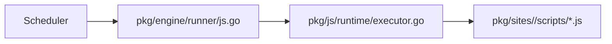
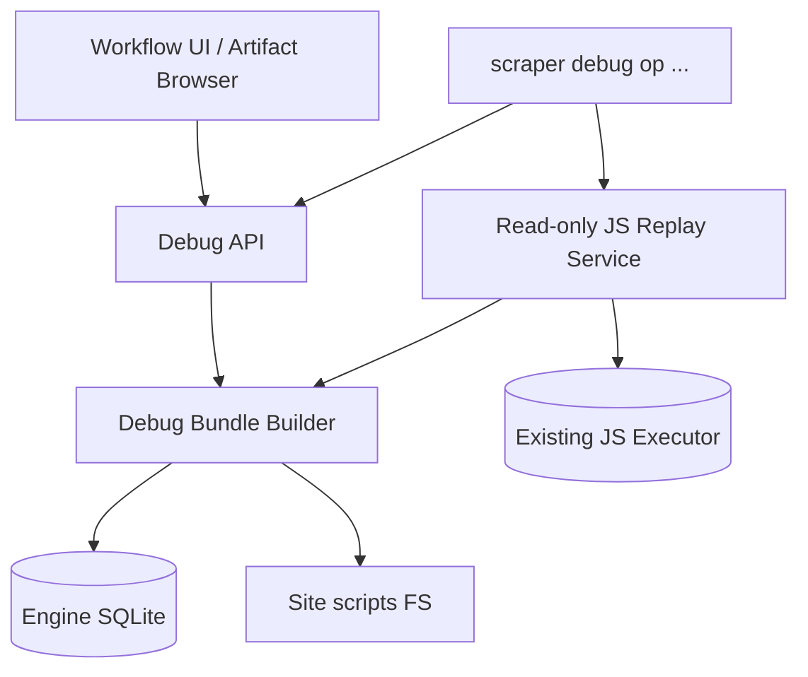

# Workflow artifact browser and JS op replay debugger guide

## Executive Summary

Scraper already persists enough state to make per-op debugging tractable, but the system does not yet expose that state in a coherent debugger workflow.

Today a user can:

- inspect workflows,
- inspect ops,
- browse some artifacts for a selected op,
- read execution logs,
- view the script source for JS-backed ops,
- inspect runtime events.

What they cannot yet do efficiently is:

- browse all artifacts for a workflow in one place,
- retrieve one op’s persisted result through a well-defined API,
- export one op’s complete execution context as a bundle,
- replay one JS script with the exact intermediate data that existed during the real run,
- tweak that data and rerun the script to isolate bugs.

The recommended design is:

1. add first-class workflow artifact and op-result APIs,
2. add a backend-generated `DebugBundle` model for one op,
3. add a read-only replay path that executes a JS op from that bundle,
4. expose that through a CLI first and the UI second.

This gives both operators and site builders a practical path to inspect and debug real workflow runs.

## Problem Statement

The current system has a lot of durable execution information, but it is fragmented.

An engineer debugging a JS op currently has to hop between:

- workflow pages,
- op detail panes,
- individual artifact downloads,
- script source views,
- runtime events,
- and sometimes SQLite inspection or ad hoc shell commands.

That fragmentation is manageable for tiny workflows but breaks down for:

- workflows with many ops,
- workflows that emit HTML artifacts and derived JSON,
- multi-page scrapes,
- site authors debugging dependency chains,
- onboarding engineers who do not yet know which artifact or result matters.

The key design task is to turn that scattered durable state into one coherent debugging unit.

## The Core Concept: Debug The Op, Not The Entire Workflow

The most important architectural decision in this ticket is the unit of debugging.

The debugger should be centered on one durable op execution, not on the entire workflow.

Why:

- an op already has a well-defined input,
- an op already has a declared script,
- an op already has dependency edges,
- an op already yields a result, artifacts, and runtime events,
- replaying one op is much cheaper and more deterministic than replaying a whole workflow.

This lets the debugger remain small and focused.

## Current System Architecture Relevant To Debugging

### Durable workflow state

The engine persists:

- workflows,
- ops,
- dependency edges,
- results,
- artifacts,
- leases.

The inspection layer is centered in:

- `pkg/services/engineview/service.go`
- `pkg/api/handlers/engine.go`

Those files already provide APIs for:

- workflow summary,
- workflow ops,
- per-op artifact listing,
- artifact body download,
- queue status.

### JS execution

The JS runner path is:



`pkg/engine/runner/js.go` does not contain the interesting debugger logic itself. It delegates to `pkg/js/runtime/executor.go`, which is the real core of JS execution.

### What the executor already knows

`pkg/js/runtime/executor.go` already builds a JS `ctx` with:

- `ctx.workflow`
- `ctx.op`
- `ctx.lease`
- `ctx.input`
- `ctx.log(...)`
- `ctx.dep(...)`
- `ctx.emit(...)`
- `ctx.writeRecord(...)`
- `ctx.writeArtifact(...)`

That is crucial. It means the future replay path can reuse the same execution model.

### What the frontend already shows

`web/src/components/workflows/OpDetailDrawer.tsx` already exposes:

- op input
- dependency list
- runtime events
- result data when available
- artifacts and previews
- execution logs
- script source text

This is a strong starting point for a richer debugger, but it is still op-inspection, not op-replay.

## Current Gaps

### Gap 1: no workflow-global artifact browser

Artifacts are currently listed per op. That is useful, but cumbersome when a workflow has many ops and the user wants to answer questions like:

- which op produced the HTML I care about?
- which op wrote the derived JSON?
- do we have execution logs for every failed op?
- which artifacts are large, recent, or text-previewable?

### Gap 2: op-result API appears incomplete

The frontend defines a `getOpResult` query in `web/src/api/workflowApi.ts`, but I could not find a matching backend handler, and a direct request returned `405`.

This needs to be normalized because op results are central to both browsing and replay.

### Gap 3: no debug bundle

The system does not yet expose a single structured object that gathers:

- workflow snapshot
- op snapshot
- dependency results
- artifact data
- script source
- runtime-event excerpt

without that bundle, every debugging tool has to reconstruct context independently.

### Gap 4: no replay path

There is currently no supported path to run:

“this exact script, for this exact op, against this exact intermediate data”

without resubmitting a workflow or manually recreating context.

## Options Considered

### Option A: improve the UI only

This would mean:

- better artifact lists,
- better previews,
- more links between ops and artifacts,
- but no replay.

Pros:

- smaller first implementation
- useful for operators

Cons:

- does not solve the actual JS debugging problem
- builders still cannot exercise one script with persisted context

Conclusion:

- worthwhile as part of the plan, but insufficient alone.

### Option B: build a CLI-only replay tool

This would mean:

- a `scraper debug op replay` command,
- bundle export and replay in the terminal,
- no new browser debugger surfaces initially.

Pros:

- strong fit for engineers
- easier to prototype safely
- no frontend complexity required first

Cons:

- operators and newer engineers may still struggle with artifacts and navigation
- lacks discoverability from the UI

Conclusion:

- a good first executable layer, but not the whole user experience.

### Option C: build a shared backend model plus CLI-first replay and UI browser

This is the recommended approach.

Pros:

- operators get a real artifact browser,
- builders get replay tooling,
- backend owns the debug bundle contract once,
- CLI and UI can share the same data model.

Cons:

- more design work up front,
- needs discipline to keep replay read-only and deterministic.

Conclusion:

- best long-term path.

## Recommended Architecture

Use a layered debugger model:



The key shared concept is the `DebugBundle`.

## The `DebugBundle` Model

The debugger needs one stable structure that explains:

- what was executed,
- with which inputs,
- based on which dependencies,
- using which script,
- producing which outputs.

Suggested shape:

```json
{
  "workflow": {},
  "op": {},
  "lease": {},
  "script": {},
  "dependencies": [],
  "artifacts": [],
  "runtimeEvents": [],
  "result": {}
}
```

### `workflow`

Should contain:

- workflow ID
- site
- workflow status
- workflow input
- workflow metadata
- created/updated timestamps

### `op`

Should contain:

- op ID
- parent ID
- kind
- queue
- op input
- retry config
- retry state
- metadata
- created/updated timestamps

### `lease`

Optional, present only if relevant:

- worker ID
- token
- acquired/expires timestamps

### `script`

Should contain:

- script path from op metadata
- actual source text
- maybe source hash later

### `dependencies`

Each dependency entry should include:

- dependency op ID
- whether it is required
- exported dependency result

The exported dependency result should reuse the same shape already produced by `exportOpResult(...)` in `pkg/js/runtime/executor.go`.

### `artifacts`

Should contain:

- artifact summaries
- selected inline body payloads for text/JSON/HTML and logs
- links or IDs for larger binary data

### `runtimeEvents`

Optional but useful:

- recent runtime events scoped to the op and workflow

### `result`

If the op has already completed:

- result data
- emitted IDs
- record writes
- error envelope when present
- completion timestamp

## API Design

### Existing endpoints to preserve

- `GET /api/v1/workflows/{workflowID}`
- `GET /api/v1/workflows/{workflowID}/ops`
- `GET /api/v1/workflows/{workflowID}/ops/{opID}/artifacts`
- `GET /api/v1/artifacts/{artifactID}`
- `GET /api/v1/sites/{site}/scripts/{path...}`

### New endpoints to add

#### `GET /api/v1/workflows/{workflowID}/artifacts`

Purpose:

- list all artifacts for the workflow across all ops

Use cases:

- workflow-global browsing,
- filtering,
- finding the right op quickly.

#### `GET /api/v1/workflows/{workflowID}/ops/{opID}/result`

Purpose:

- return the persisted op result through an explicit supported route

#### `GET /api/v1/workflows/{workflowID}/ops/{opID}/debug-bundle`

Purpose:

- return the consolidated op debug bundle

This is the key debugger route.

#### Optional later: `POST /api/v1/debug/replay`

Purpose:

- run a read-only replay from a debug bundle or workflow/op reference

This can wait until Phase 3 or 4, but it is the natural API surface once bundle generation exists.

## CLI Design

The CLI should likely come first for replay.

Suggested commands:

```text
scraper debug op bundle --workflow-id <id> --op-id <id>
scraper debug op replay --workflow-id <id> --op-id <id>
scraper debug op replay --bundle debug-bundle.json
```

### Why CLI first

- easier to iterate on replay semantics
- easier to keep read-only and deterministic
- easier for engineers to test against local site changes
- lower UI complexity during initial rollout

### CLI output modes

- human-readable summary
- JSON envelope
- optional artifact dump directory

## Replay Design

### Principle: replay should be read-only by default

The first replay implementation should not:

- create durable ops,
- write to the engine DB,
- mutate site DBs,
- write real artifacts into the workflow history.

Instead it should capture:

- replay logs,
- replay-emitted ops,
- replay-record writes,
- replay-artifacts,
- replay result data,
- replay error if thrown.

### Replay pseudocode

```text
func ReplayDebugBundle(bundle):
    load script source from bundle or site FS
    create replay dependency resolver from bundle.dependencies
    create replay execution request from bundle.workflow + bundle.op + bundle.lease
    build JS runtime with same module set as live execution
    intercept writeRecord / writeArtifact / emit into in-memory capture
    execute script
    return replay result envelope
```

### Reusing the current executor

The best path is not to build a second execution engine. Instead:

- reuse `pkg/js/runtime/executor.go` where possible,
- add a replay mode or replay-specific adapters for:
  - dependency resolution
  - artifact capture
  - write interception

This lowers divergence between live execution and replay execution.

## Frontend Design

### Step 1: artifact browser

Before replay UI, add a better browser.

Recommended UX:

- workflow-level artifact tab
- filters:
  - op
  - kind
  - content type
  - name substring
- preview panel for:
  - JSON
  - text
  - HTML
  - execution-log

### Step 2: op debugger launch

In `OpDetailDrawer`:

- add a “Debug Bundle” action
- add a “Replay JS” action only for `kind === "js"`

### Step 3: optional replay panel

Later, if UI replay is desired:

- left side: bundle/context
- center: editable input overrides
- right side: replay output/result/logs

But do not start there.

## File-Level Implementation Map

### Backend

- `pkg/services/engineview/service.go`
  - add workflow-global artifact listing
  - add op-result retrieval
- `pkg/api/handlers/engine.go`
  - expose the new result and artifact routes
- new package, likely `pkg/services/debugbundle/`
  - build `DebugBundle`
  - gather dependency results
  - gather script source
  - gather artifacts
  - gather optional runtime events
- new package, likely `pkg/services/debugreplay/`
  - execute replay bundles read-only

### Runtime

- `pkg/js/runtime/executor.go`
  - reuse or refactor lightly to support replay-specific adapters

### CLI

- `cmd/scraper/...`
  - add `debug` command group
  - add `bundle` and `replay` subcommands

### Frontend

- `web/src/api/workflowApi.ts`
  - fix or normalize the op-result route
  - add workflow-artifacts and debug-bundle queries
- `web/src/pages/WorkflowDetailPage.tsx`
  - add workflow artifact browser
- `web/src/components/workflows/OpDetailDrawer.tsx`
  - add debugger actions

## Intern Implementation Plan

### Phase 1: make current data fully accessible

1. Add a supported op-result endpoint.
2. Add workflow-global artifact listing.
3. Add tests for both.

This is the lowest-risk start and improves debugging immediately.

### Phase 2: add `DebugBundle`

1. Define bundle DTOs.
2. Implement bundle-builder service.
3. Add one endpoint to fetch a bundle.
4. Add unit tests for:
   - successful bundle generation,
   - missing dependency result,
   - missing script source,
   - artifact body inclusion rules.

### Phase 3: add CLI replay

1. Add `scraper debug op bundle`.
2. Add `scraper debug op replay`.
3. Make replay read-only.
4. Return a clear replay result envelope.

### Phase 4: add richer UI

1. Add workflow artifact browser.
2. Add debug-bundle export affordance in op detail.
3. Only then consider UI-triggered replay.

## Safety Rules

The debugger should be explicit about side effects.

Rules:

- replay is read-only by default,
- replay output is marked non-durable,
- replay must not update workflow status,
- replay must not insert ops into the engine DB,
- replay must not mutate site DBs unless a future explicit opt-in mode is added.

## Testing Strategy

### Unit tests

- bundle generation
- result export
- replay adapter behavior
- artifact inclusion filtering

### Integration tests

- generate bundle from real completed `js-demo` and `hackernews` workflows
- replay one JS op from the bundle
- compare live and replay output shape

### Manual smoke test

1. submit a real workflow,
2. wait for completion,
3. export a debug bundle for a JS op,
4. replay that op locally,
5. inspect replay result and logs.

## Open Questions

- Should the first replay path allow input overrides, or only exact-replay mode?
- Should artifact bodies be embedded inline up to a size threshold, or always fetched separately?
- Should replay capture runtime events too, or are logs and result envelopes enough for v1?
- Should binary artifacts be excluded from the first bundle format?

## Recommendation

Build this as:

1. artifact/result API normalization,
2. debug-bundle generation,
3. CLI-first replay,
4. UI artifact-browser upgrades,
5. optional UI replay later.

That sequence gives immediate debugging value, reuses the existing durable model, and keeps the risky part, replay, under tight control.

## References

- `pkg/api/handlers/engine.go`
- `pkg/services/engineview/service.go`
- `pkg/engine/runner/js.go`
- `pkg/js/runtime/executor.go`
- `pkg/engine/model/types.go`
- `web/src/components/workflows/OpDetailDrawer.tsx`
- `web/src/components/scripts/ScriptTab.tsx`
- `web/src/api/workflowApi.ts`
