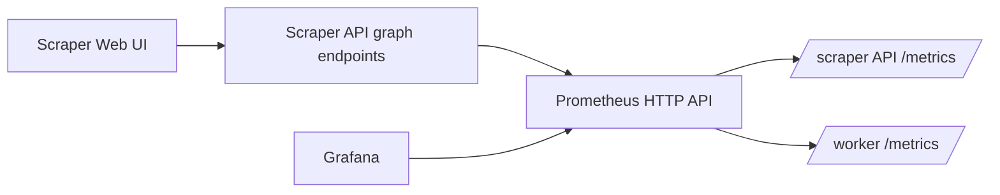
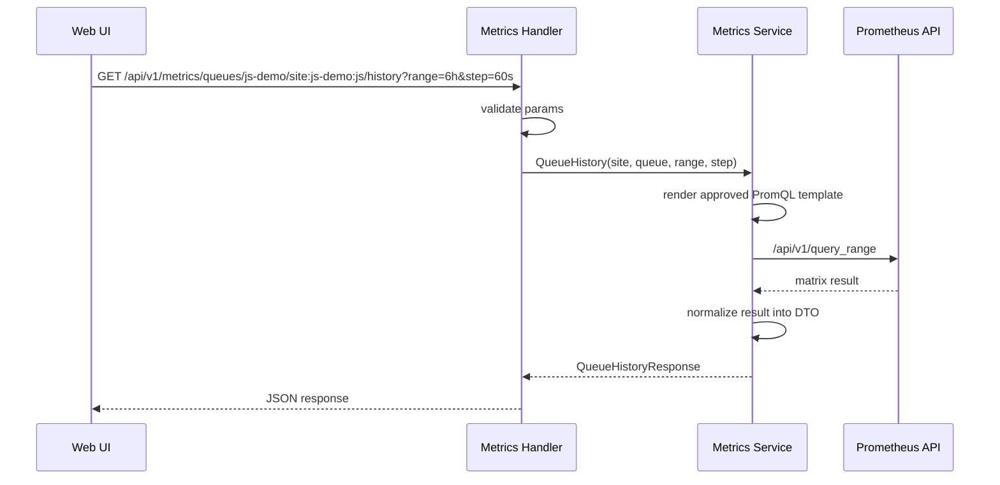

# Prometheus-backed API endpoints and web UI graph integration guide

## Executive Summary

Scraper already has Prometheus metrics and Grafana dashboards, but the normal web UI still lacks a backend API for historical graph data. As a result, pages such as `web/src/pages/QueueMonitorPage.tsx` fall back to placeholder series, while `web/src/pages/EngineOverviewPage.tsx` can only show current snapshots from the engine API.

The recommended design is to add scraper-owned HTTP endpoints that query Prometheus on behalf of the frontend and return normalized JSON for a small set of approved graphs. This gives the product team historical charts inside the web UI without forcing the browser to know PromQL, without coupling the UI to Grafana embeds, and without turning scraper into an unrestricted metrics proxy.

In short:

- keep Prometheus as the time-series engine
- keep Grafana as the rich operator dashboard
- add scraper API endpoints for curated graph data
- do not expose arbitrary PromQL to callers
- do not have the browser call Prometheus directly

## Why This Ticket Exists

The Prometheus metrics ticket established the observability foundation:

- instrumentation exists in the API server and worker
- Prometheus scrape config exists in `ops/monitoring/prometheus/prometheus.yml`
- Grafana dashboards exist in `ops/monitoring/grafana/dashboards/scraper-overview.json`
- alerts and recording rules already exist

That solved backend observability, but not product integration.

Right now the system has an uncomfortable split:

- operators can see historical metrics in Grafana
- scraper pages still operate mostly on snapshot APIs and live runtime events
- the queue monitor still ships placeholder throughput data

So the next architectural step is not “more metrics.” It is “make the existing metrics available to scraper’s own UI in a clean, stable, application-owned way.”

## Problem Statement

The frontend needs historical charts for queue depth, throughput, wait times, retry rates, worker health, and similar operator signals. Prometheus already contains that data, but there is no current application API that turns it into a safe, product-friendly contract.

Three direct problems follow from that gap:

1. The web UI cannot render real historical graphs without either:
   - talking directly to Prometheus, or
   - embedding Grafana, or
   - inventing its own separate time-series storage
2. The browser currently lacks a clean way to ask for queue-specific or site-specific metric histories.
3. The product boundary is fuzzy: object-level state comes from scraper APIs, but historical time-series would need to come from somewhere else.

The design needs to solve those product and ownership problems without undermining the Prometheus/Grafana work that already landed.

## Current State Review

### API server already exposes raw metrics

`pkg/api/server/server.go` wires `GET /metrics` directly onto the server mux. That means the API process already has a Prometheus-facing export surface. It does not yet expose any scraper-facing historical metrics routes such as `/api/v1/metrics/overview`.

This distinction matters:

- `/metrics` is for Prometheus scraping
- `/api/v1/...` is for the product frontend

Those should remain separate.

### Engine overview is snapshot-only

`web/src/pages/EngineOverviewPage.tsx` currently loads:

- `useGetEngineStatusQuery`
- `useListQueuesQuery`

Those are snapshot APIs backed by the engine database, not time-series history. They are correct for “what is true now?” but insufficient for “what has been happening for the last 6 hours?”

### Queue monitor still uses placeholders

`web/src/pages/QueueMonitorPage.tsx` includes `placeholderThroughput` and an explicit comment that it is temporary until real throughput metrics are wired. This is the clearest sign that the frontend is waiting on a backend graph data contract.

### Prometheus and Grafana are already real

`ops/monitoring/prometheus/prometheus.yml` already scrapes:

- `scraper-api`
- `scraper-worker`

`ops/monitoring/grafana/dashboards/scraper-overview.json` already renders real panels for:

- workers up
- active workflows
- ready queue depth
- worst queue wait p95
- workflow submit rate
- op completion rate

So the problem is not data availability. The problem is application integration.

## Proposed Solution

Add a backend metrics-query service plus a small set of HTTP handlers that expose curated historical graph data as normalized JSON.

The flow should look like this:



This keeps one clean ownership model:

- scraper exports metrics
- Prometheus stores and evaluates them
- Grafana explores them
- scraper API republishes a narrow, product-specific subset for the web UI

### Core idea: query registry, not freeform PromQL

The frontend should never submit arbitrary PromQL strings. Instead, scraper should define a registry of allowed graph types. Each graph type maps to:

- a human meaning
- a PromQL template
- required parameters
- allowed optional filters
- a normalization function

Example registry entries:

- `overview-active-workflows`
- `overview-worst-queue-wait-p95`
- `queue-ready-depth`
- `queue-completion-rate`
- `queue-wait-p95`
- `site-submit-rate`
- `workers-up`

### Core idea: normalized DTOs

Prometheus API responses are not pleasant frontend contracts. They expose result types, labels, and raw tuples in a format that leaks storage concerns into the UI.

Scraper should instead return a stable DTO such as:

```json
{
  "graph": "queue-history",
  "scope": {
    "site": "js-demo",
    "queue": "site:js-demo:js"
  },
  "range": "6h",
  "stepSeconds": 60,
  "series": [
    {
      "id": "ready-depth",
      "label": "Ready",
      "unit": "ops",
      "points": [
        { "ts": "2026-04-07T16:00:00Z", "value": 4 },
        { "ts": "2026-04-07T16:01:00Z", "value": 6 }
      ]
    }
  ]
}
```

This lets the frontend stay focused on rendering.

## Design Goals

- Keep the browser independent from Prometheus internals.
- Avoid direct browser access to Prometheus.
- Avoid arbitrary query passthrough.
- Preserve the existing separation between object-state APIs and metrics APIs.
- Keep route shapes simple and product-oriented.
- Use bounded parameters and low-cardinality filters only.
- Make it easy to unit-test with fake Prometheus responses.
- Make it easy to evolve graph internals without breaking the frontend contract.

## Non-Goals

- Replacing Grafana.
- Replacing existing engine, workflow, queue, or runtime-event APIs.
- Exposing a generic Prometheus explorer inside scraper.
- Supporting arbitrary ad hoc query composition from the frontend.
- Using Prometheus as a debugging database for workflow- or op-level drilldown.

## Architecture Choices And Tradeoffs

### Option A: Browser talks directly to Prometheus

This is the simplest technical path, but the worst product boundary.

Pros:

- no scraper backend work for graph data
- frontend can use Prometheus immediately

Cons:

- frontend must know PromQL
- frontend must know Prometheus URL and auth model
- query stability becomes a frontend concern
- changing metric names or labels becomes a UI-breaking change
- browser gains too much access to raw observability data
- hard to constrain, validate, or evolve safely

Recommendation: reject.

### Option B: Embed Grafana panels in scraper

This is attractive for speed, especially if dashboards already exist.

Pros:

- fast path to real graphs
- dashboard authoring already exists
- little additional backend work

Cons:

- weak product integration
- awkward auth/session model in many deployments
- inconsistent UX and theming
- frontend still does not own the graph contract
- hard to combine precisely with scraper’s own stateful views

Recommendation: useful as a secondary convenience, but not the primary product architecture.

### Option C: Scraper API proxies a curated set of Prometheus queries

This is the recommended path.

Pros:

- frontend stays scraper-native
- backend validates requests
- backend owns graph contract
- PromQL stays hidden
- easy to test with mock Prometheus responses
- easy to layer caching and normalization later

Cons:

- requires new backend service and DTO work
- introduces an additional boundary to maintain
- needs careful scoping to avoid becoming a general-purpose query gateway

Recommendation: choose this option.

## Design Decisions

### Decision 1: add dedicated metrics-query service

Create a backend package such as `pkg/services/metricsapi/` with responsibilities:

- execute approved Prometheus instant/range queries
- render PromQL from approved templates
- validate time ranges and filter parameters
- normalize Prometheus responses into product DTOs

This should not live in `engineview.Service` because that service is database-oriented and object-state-oriented.

### Decision 2: keep route design product-first

Routes should be shaped around UI needs, not Prometheus API shapes.

Suggested initial routes:

- `GET /api/v1/metrics/overview`
- `GET /api/v1/metrics/queues/{site}/{queue}/history`
- `GET /api/v1/metrics/sites/{site}/history`
- `GET /api/v1/metrics/workers/history`
- `GET /api/v1/metrics/metadata`

Example purpose:

- `overview`: dashboard cards and top-level trend series
- `queues/.../history`: queue page graphs
- `sites/.../history`: site-level operator view
- `workers/history`: worker health/trend panels
- `metadata`: allowed ranges, default steps, and graph labels

### Decision 3: allow only bounded filtering

Allowed filters should be small and explicit:

- `site`
- `queue`
- `runner`
- `range`
- `step`

Do not allow:

- `workflow_id`
- `op_id`
- `request_id`
- arbitrary label expressions
- arbitrary PromQL snippets

### Decision 4: normalize all timestamps and units

The frontend should receive:

- RFC3339 timestamps
- numeric values
- explicit series IDs and labels
- units such as `ops`, `seconds`, `ratio`, `requests_per_second`

Do not make the frontend infer unit semantics from metric names.

### Decision 5: keep current-state APIs and historical APIs separate

Current state belongs to:

- `engineview.Service`
- catalog endpoints
- runtime-event endpoints

Historical graph data belongs to the new Prometheus-backed graph service.

This avoids mixing “what is true now in the engine DB?” with “what has trended over time in Prometheus?”

## Proposed API Shapes

### `GET /api/v1/metrics/overview`

Purpose:

- top-level cards and overview charts for the engine overview page

Example response:

```json
{
  "cards": [
    { "id": "workers-up", "label": "Workers Up", "value": 2, "unit": "count" },
    { "id": "active-workflows", "label": "Active Workflows", "value": 18, "unit": "count" },
    { "id": "worst-queue-wait-p95", "label": "Worst Queue Wait P95", "value": 42.5, "unit": "seconds" }
  ],
  "series": [
    {
      "id": "workflow-submit-rate",
      "label": "Workflow Submit Rate",
      "unit": "ops_per_second",
      "points": []
    }
  ]
}
```

### `GET /api/v1/metrics/queues/{site}/{queue}/history?range=6h&step=60s`

Purpose:

- queue-specific historical charts for queue monitor and detail views

Suggested returned series:

- ready depth
- running depth
- completion rate
- failure rate
- retry rate
- queue wait p95
- throttling rate

### `GET /api/v1/metrics/sites/{site}/history?range=24h&step=300s`

Purpose:

- site-level operational trends across multiple queues

Suggested returned series:

- workflow submit rate
- op completion rate by status
- queue wait p95 by queue
- failure rate by queue

### `GET /api/v1/metrics/workers/history?range=6h&step=60s`

Purpose:

- worker liveness and throughput over time

Suggested returned series:

- workers up
- scheduler cycles
- leased ops rate
- completion rate

### `GET /api/v1/metrics/metadata`

Purpose:

- let frontend discover supported graph families, allowed time ranges, default steps, and units

This endpoint is optional for the first implementation, but it is useful if the frontend will eventually render common graph controls instead of hard-coded page-specific assumptions.

## Data Flow And Internal Components

### Proposed package outline

```text
pkg/
  services/
    metricsapi/
      client.go          # Prometheus HTTP client
      registry.go        # graph IDs -> PromQL templates + metadata
      service.go         # orchestration and normalization
      dto.go             # response types
      errors.go          # stable error categories
  api/
    handlers/
      metrics.go         # HTTP handlers for /api/v1/metrics/*
```

### Internal call flow



### Example service pseudocode

```text
func (s *Service) QueueHistory(ctx, site, queue, range, step):
    if !validSite(site) or !validQueue(queue):
        return validation error
    if !allowedRange(range) or !allowedStep(step):
        return validation error

    querySpec = registry.Lookup("queue-history")
    promQL = querySpec.Render({
        site: site,
        queue: queue,
        range: range,
        step: step,
    })

    matrix = prometheusClient.QueryRange(ctx, promQL, range, step)
    return normalizeQueueHistory(matrix)
```

## Query Registry Design

The registry is the key control point. It prevents scraper from becoming a generic Prometheus shell.

Each entry should define:

- `GraphID`
- `Description`
- `Kind` (`instant` or `range`)
- `PromQLTemplate`
- `AllowedFilters`
- `DefaultRange`
- `AllowedRanges`
- `DefaultStep`
- `Unit`
- `Normalizer`

Example conceptual entry:

```text
GraphID: queue-wait-p95
Kind: range
PromQLTemplate: histogram_quantile(0.95, sum by (le, site, queue, runner) (
  rate(scraper_queue_wait_seconds_bucket{site="{{site}}", queue="{{queue}}"}[15m])
))
AllowedFilters: site, queue
DefaultRange: 6h
AllowedRanges: 1h, 6h, 24h, 7d
DefaultStep: 60s
Unit: seconds
```

## Validation Rules

An intern implementing this should treat validation as a first-class feature, not as cleanup.

Validate:

- route parameters are syntactically valid
- `range` belongs to a fixed allow-list
- `step` belongs to a fixed allow-list or bounded min/max
- requested graph type is known
- optional site/queue filters are correctly formatted

Reject:

- empty or malformed site/queue identifiers
- unsupported graph IDs
- arbitrary label filters
- oversized time ranges
- overly granular steps

This protects:

- performance
- cardinality
- response size
- future contract stability

## Error Model

The graph API should return stable scraper-style errors, not raw Prometheus details.

Suggested categories:

- `invalid_argument`
- `unsupported_graph`
- `prometheus_unavailable`
- `prometheus_timeout`
- `prometheus_bad_response`
- `internal_error`

The HTTP handler can log the full upstream error, but the frontend should receive a stable, concise structure.

## Caching And Performance

The first implementation does not need a heavy caching layer, but the design should leave room for it.

Reasonable initial strategy:

- no persistent cache
- rely on Prometheus as the source of truth
- keep time ranges bounded
- keep graph count small

Possible later optimization:

- short in-memory cache keyed by `graphID + filters + range + step`
- TTL around 5 to 15 seconds for shared overview graphs

Do not add this unless needed by measured traffic.

## Security And Exposure Model

Do not expose:

- raw PromQL passthrough
- Prometheus base URL to the browser
- arbitrary labels or metric names
- high-cardinality selectors

Do expose:

- curated metrics families already intended for operator visualization
- bounded filters like site, queue, and runner
- normalized DTOs that hide storage details

This is both a product and operational design choice.

## Testing Strategy

### Unit tests

Add focused tests for:

- query registry lookup
- template rendering
- range/step validation
- DTO normalization from Prometheus API responses
- upstream error mapping

### Handler tests

Add HTTP tests for:

- valid overview request
- valid queue history request
- bad `range`
- bad `step`
- unknown graph or route parameters
- Prometheus timeout path

### Integration smoke test

Use the existing local compose Prometheus stack.

Test flow:

1. start API, worker, Prometheus, Grafana
2. submit demo workflow
3. query new `/api/v1/metrics/...` endpoints
4. verify series are returned and roughly match Grafana/Prometheus

## Implementation Plan

- Add server config for Prometheus upstream URL and timeout.
- Create `pkg/services/metricsapi/client.go` for Prometheus HTTP calls.
- Create `pkg/services/metricsapi/registry.go` for approved graph definitions.
- Create `pkg/services/metricsapi/service.go` for orchestration and normalization.
- Add `pkg/api/handlers/metrics.go`.
- Wire `/api/v1/metrics/...` routes in `pkg/api/server/server.go`.
- Add unit and handler tests.
- Add a local smoke-test playbook after implementation.
- Use a separate frontend ticket to replace placeholder throughput and add overview graphs.

## Suggested Initial Graph Matrix

| Page | Graph/Card | Backing metrics |
| --- | --- | --- |
| Engine overview | Workers up | `scraper_workers_up` |
| Engine overview | Active workflows | `scraper_engine_workflow_status_total` |
| Engine overview | Worst queue wait p95 | `scraper:queue_wait_p95_15m` |
| Engine overview | Workflow submit rate | `scraper_workflows_submitted_total` |
| Queue monitor | Ready depth | `scraper_queue_state_total{state="ready"}` |
| Queue monitor | Running depth | `scraper_queue_state_total{state="running"}` |
| Queue monitor | Completion rate | `scraper_ops_completed_total` |
| Queue monitor | Retry rate | `scraper_op_retries_total` |
| Queue monitor | Queue wait p95 | `scraper_queue_wait_seconds_bucket` / recording rule |
| Queue monitor | Throttle rate | `scraper_queue_rate_limited_total` |

## Open Questions

- Should `overview` be a composite endpoint or should cards and series be split into separate routes?
- Should `metadata` ship in v1, or can the frontend hard-code graph controls initially?
- Do we want minimal short-term caching in the backend from the first iteration, or only after measuring traffic?
- Should worker history be exposed as a dedicated endpoint from day one, or can that wait until operators ask for it inside the app?

## Recommendation

Build scraper-owned, Prometheus-backed graph endpoints as a small backend service with a fixed query registry and normalized JSON responses. This is the clean middle path between “browser talks directly to Prometheus” and “just embed Grafana everywhere.”

It keeps the product boundary coherent:

- object state and debugging detail remain scraper-native
- time-series remain Prometheus-native
- the frontend stays simple and stable
- Grafana remains valuable without becoming the only way to see history

## References

- `pkg/api/server/server.go`
- `pkg/services/engineview/service.go`
- `web/src/pages/EngineOverviewPage.tsx`
- `web/src/pages/QueueMonitorPage.tsx`
- `ops/monitoring/prometheus/prometheus.yml`
- `ops/monitoring/grafana/dashboards/scraper-overview.json`
- `ttmp/2026/04/07/SCRAPER-PROMETHEUS-METRICS--prometheus-metrics-and-operator-observability-architecture/design-doc/01-prometheus-metrics-architecture-and-implementation-guide-for-operator-observability.md`

## Alternatives Considered

<!-- List alternative approaches that were considered and why they were rejected -->

## Implementation Plan

<!-- Outline the steps to implement this design -->

## Open Questions

<!-- List any unresolved questions or concerns -->

## References

<!-- Link to related documents, RFCs, or external resources -->
