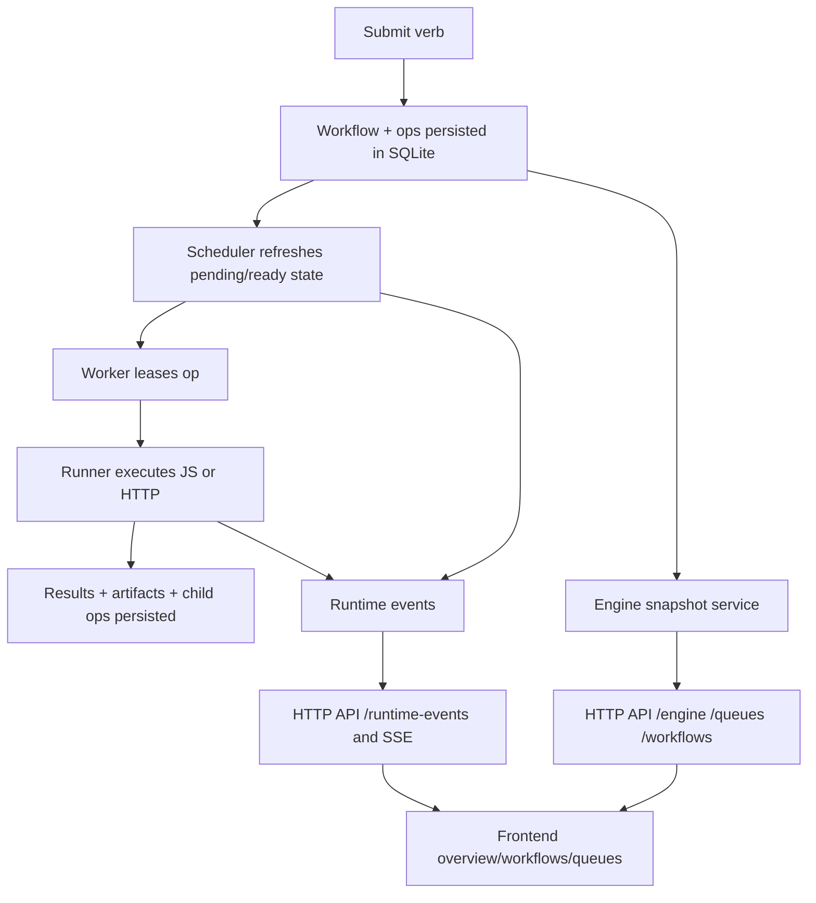
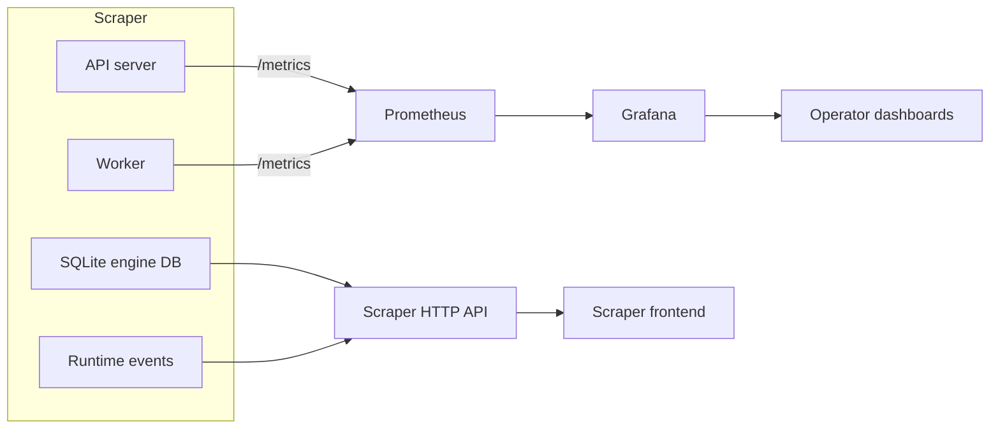

# Prometheus metrics architecture and implementation guide for operator observability

## Executive Summary

Scraper should add Prometheus, but not as a replacement for its own state model. The application already has durable workflow and op state, runtime events, artifacts, and queue snapshots. Those are not metrics; they are product data. Prometheus should be added specifically for what it does well: counters, gauges, histograms, historical retention, alerting, and time-series aggregation.

The correct architecture is a hybrid one:

- scraper remains the source of truth for workflows, ops, dependencies, artifacts, queue configuration, and runtime-event detail,
- Prometheus becomes the source of truth for numeric operational time-series such as throughput, latency, retry rates, queue saturation, and throttling frequency,
- Grafana is the primary historical operator UI,
- the scraper frontend continues to show current state and debugging detail, and may later link to or lightly integrate Prometheus-backed historical views.

This split minimizes custom engineering on scraper’s side without flattening the product into a pure metrics dashboard. It is also the right answer to the user’s original intuition: Prometheus does simplify the history/alerting side because scraper no longer has to invent its own metrics store and retention model, but scraper still needs to keep domain state because Prometheus cannot replace workflow-level debugging.

## Problem Statement

Scraper currently exposes some observability, but it is incomplete and split across mismatched channels.

What exists today:

- point-in-time engine and queue snapshots via `engineview.Service` and the HTTP API,
- live runtime events via Watermill and SSE,
- logs in worker/server output,
- a queue monitor page and an overview page in the frontend.

What does not exist today:

- a Prometheus registry,
- `/metrics` endpoints on server or worker,
- durable time-series for operator history,
- alerting semantics,
- Grafana dashboards,
- trustworthy throughput charts in the app.

That mismatch is visible in the frontend. The queue monitor page explicitly uses static random placeholder throughput data in [QueueMonitorPage.tsx](/home/manuel/workspaces/2026-03-23/js-scraper/scraper/web/src/pages/QueueMonitorPage.tsx). The overview page uses point-in-time snapshot APIs from [engineApi.ts](/home/manuel/workspaces/2026-03-23/js-scraper/scraper/web/src/api/engineApi.ts) and [queueApi.ts](/home/manuel/workspaces/2026-03-23/js-scraper/scraper/web/src/api/queueApi.ts), which is useful for current status but insufficient for historical trends.

The question, then, is not whether metrics are useful. They are. The real question is how to add them without:

- duplicating state already stored in SQLite,
- turning Prometheus into a debugging database,
- introducing high-cardinality label explosions,
- coupling the frontend too tightly to Prometheus internals.

This document answers that question.

## Personas And The Questions They Need Answered

### Operator running many workflows over days

This person needs fast answers to questions like:

- Are queues backing up over time?
- Which sites are failing more than usual?
- Are workers saturated?
- Did retry rate spike after a deploy?
- Is a queue being throttled constantly?
- Is throughput improving or degrading?

These are time-series questions. Prometheus is a good fit.

### Verb builder debugging a specific workflow

This person needs answers to questions like:

- What ops did the submit verb emit?
- Which dependency is blocking this op?
- Which runtime event shows the failure?
- Which artifact contains the response body or log?

These are object-level debugging questions. Prometheus is a poor fit. Scraper’s DB, runtime events, and artifacts are the right source.

### New engineer onboarding into the system

This person needs to understand:

- what a workflow is,
- what an op is,
- how queues and rate limits work,
- what runtime events are,
- what metrics are and are not.

That means the implementation needs a clear conceptual boundary between:

- state,
- events,
- metrics.

## Current Observability Inventory

Scraper already exposes three partial observability layers.

### Layer 1: Durable state snapshots

The engine snapshot service in [service.go](/home/manuel/workspaces/2026-03-23/js-scraper/scraper/pkg/services/engineview/service.go) exposes:

- engine status,
- workflow lists,
- workflow ops,
- queue status,
- artifacts.

The engine status path in [status.go](/home/manuel/workspaces/2026-03-23/js-scraper/scraper/pkg/engine/store/sqlite/status.go) computes counts such as:

- workflow count,
- op counts by status,
- active and expired leases,
- result count,
- artifact count.

The queue list path in [service.go](/home/manuel/workspaces/2026-03-23/js-scraper/scraper/pkg/services/engineview/service.go) computes per-queue snapshots such as:

- pending,
- ready,
- running,
- succeeded,
- failed,
- in-flight,
- token bucket state when present.

This layer is excellent for current state, but it is not a history system.

### Layer 2: Runtime events

The runtime-event transport in [backend.go](/home/manuel/workspaces/2026-03-23/js-scraper/scraper/pkg/runtimeevents/backend.go) and the API server wiring in [server.go](/home/manuel/workspaces/2026-03-23/js-scraper/scraper/pkg/api/server/server.go) already provide:

- event publication from submission, request handling, and scheduler/worker code,
- recent event history,
- live SSE streaming.

The scheduler-to-event mapping in [scheduler.go](/home/manuel/workspaces/2026-03-23/js-scraper/scraper/pkg/runtimeevents/scheduler.go) covers key events such as:

- op leased,
- op succeeded,
- op retried,
- op failed,
- queue rate limited.

This is useful for timelines and debugging, but it is not a good substitute for metric aggregations. You can derive some metrics from events, but it is fragile, expensive, and harder to alert on cleanly.

### Layer 3: Logs

The worker and API server still emit regular logs. Those are useful for local development and incident detail, but they are not operator dashboards.

### What is missing

No code currently exposes:

- Prometheus counters,
- Prometheus gauges,
- Prometheus histograms,
- `/metrics` endpoints,
- scrape-target topology,
- alert rules,
- dashboard bundles.

That is why the queue monitor still falls back to fake throughput.

## Current Architecture Diagram



This is already a solid product-state architecture. Prometheus should be added beside it, not through it.

## What Prometheus Solves And What It Does Not Solve

### What Prometheus solves well

- request and operation rates,
- latency distributions,
- retry frequency,
- queue saturation,
- rate-limit hit frequency,
- worker heartbeat-like liveness,
- historical charts,
- alerting and recording rules.

### What Prometheus does not solve well

- workflow dependency graphs,
- emitted op inspection,
- artifacts,
- per-workflow debugging,
- free-form event details,
- exact failure narratives,
- high-cardinality object histories.

### The design boundary

Use scraper state and runtime events for:

- “what is happening to this workflow?”
- “why is this op pending?”
- “what did this script emit?”

Use Prometheus for:

- “how many ops per minute are failing on this site?”
- “what is p95 queue wait time for this queue?”
- “how often are we rate limited?”
- “did throughput drop in the last 6 hours?”

## Proposed Solution

### Core recommendation

Add a dedicated metrics subsystem using Prometheus client instrumentation in Go, expose `/metrics` endpoints on the API server and worker, scrape them with Prometheus, visualize with Grafana, and keep the scraper frontend focused on current state plus debugging detail.

### High-level architecture



The key is that Prometheus receives instrumentation directly from API server and worker. It should not have to reconstruct the world from runtime events or database polling.

## Design Decisions

### Decision 1: Do not build a custom metrics history store inside scraper

Reasoning:

- Prometheus already solves retention, scrapes, aggregation, histograms, and alerting.
- Building that inside scraper would create a second persistence problem with lower value than using existing tooling.
- The application team should spend effort on workflow debugging and operator UX, not inventing a metrics backend.

### Decision 2: Do not replace scraper state APIs with Prometheus

Reasoning:

- The existing APIs already express domain objects cleanly.
- Prometheus is not designed to be queried like a debugging database.
- High-cardinality labels such as `workflow_id` and `op_id` would be dangerous and expensive.

### Decision 3: Instrument at source, not by re-aggregating runtime events

Reasoning:

- Direct instrumentation is simpler and more accurate for counters and histograms.
- Runtime events remain useful for drilldown, but metrics should not depend on an event consumer to reconstruct core rates.
- A Prometheus metric should be updated where the operation actually succeeds, fails, retries, or waits.

### Decision 4: Give the worker its own metrics listener

Reasoning:

- The worker is a standalone process started from [worker.go](/home/manuel/workspaces/2026-03-23/js-scraper/scraper/pkg/cmd/worker.go), not just a handler inside the API server.
- Worker-specific metrics such as queue leasing, execution duration, retry counts, and HTTP runner latency belong to the worker process.
- Without a worker listener, metrics would have to be proxied or pushed elsewhere, which is more complex and less idiomatic than scraping.

### Decision 5: Grafana first, scraper frontend later for history

Reasoning:

- Grafana already provides flexible time-series visualization.
- The scraper frontend should not block on building a full historical charting subsystem.
- The first operator deliverable should be trustworthy dashboards, not a deep Prometheus query UI inside scraper.

## Metric Taxonomy

The safest way to design metrics is to separate them by semantic type.

### Submission metrics

Use these to understand demand entering the system.

Examples:

- `scraper_workflows_submitted_total{site,verb}`
- `scraper_submission_failures_total{site,verb,error_code}`

Instrumentation seam:

- [service.go](/home/manuel/workspaces/2026-03-23/js-scraper/scraper/pkg/services/submission/service.go)

### HTTP API metrics

Use these to understand the server surface and client-facing latency.

Examples:

- `scraper_http_requests_total{method,route,status_class}`
- `scraper_http_request_duration_seconds{method,route,status_class}`

Instrumentation seam:

- request wrapper in [server.go](/home/manuel/workspaces/2026-03-23/js-scraper/scraper/pkg/api/server/server.go)

### Scheduler and queue metrics

Use these to understand leasing, throttling, queue pressure, and worker activity.

Examples:

- `scraper_scheduler_cycles_total{worker_id}`
- `scraper_queue_candidates{worker_id}`
- `scraper_ops_leased_total{site,queue,runner}`
- `scraper_queue_rate_limited_total{site,queue}`
- `scraper_queue_wait_seconds{site,queue,runner}`

Instrumentation seams:

- [scheduler.go](/home/manuel/workspaces/2026-03-23/js-scraper/scraper/pkg/engine/scheduler/scheduler.go)
- store lease path in [store.go](/home/manuel/workspaces/2026-03-23/js-scraper/scraper/pkg/engine/store/sqlite/store.go)

### Runner metrics

Use these to understand execution cost and failure patterns.

Examples:

- `scraper_op_duration_seconds{site,queue,runner,status}`
- `scraper_op_failures_total{site,queue,runner,error_code}`

For HTTP runner specifically:

- `scraper_http_runner_requests_total{site,queue,status_class}`
- `scraper_http_runner_duration_seconds{site,queue,status_class}`

Instrumentation seam:

- [http.go](/home/manuel/workspaces/2026-03-23/js-scraper/scraper/pkg/engine/runner/http.go)

### State-export gauges

These are derived from current state, not event counters. They should typically be collected on scrape from the DB/API process.

Examples:

- `scraper_queue_pending{site,queue}`
- `scraper_queue_ready{site,queue}`
- `scraper_queue_running{site,queue}`
- `scraper_queue_in_flight{site,queue}`
- `scraper_queue_tokens{site,queue}`
- `scraper_engine_workflows{status}`

Instrumentation seam:

- [service.go](/home/manuel/workspaces/2026-03-23/js-scraper/scraper/pkg/services/engineview/service.go)
- [status.go](/home/manuel/workspaces/2026-03-23/js-scraper/scraper/pkg/engine/store/sqlite/status.go)

## Label Strategy And Cardinality Rules

This is the most important operational rule in the entire design.

### Safe-ish labels

Use labels that are bounded and repeat often:

- `site`
- `queue`
- `verb`
- `runner`
- `method`
- `route`
- `status`
- `status_class`
- `worker_id` if worker count is small and controlled

### Dangerous labels

Do not use these in normal Prometheus metrics:

- `workflow_id`
- `op_id`
- `artifact_id`
- `request_id`
- arbitrary URLs
- raw error messages

### Why

Prometheus stores a distinct series per unique label set. High-cardinality labels explode series counts and make the system expensive and fragile.

### Rule of thumb

If the label value is unique per request or per workflow, it probably does not belong in Prometheus.

## Proposed Package Structure

A simple package split is enough.

```text
pkg/metrics/
  registry.go
  api_server.go
  worker.go
  scheduler.go
  submission.go
  runner.go
  snapshot_collector.go
```

Responsibilities:

- `registry.go`: create/register the collectors
- `api_server.go`: HTTP middleware and `/metrics` handler helpers
- `worker.go`: worker metrics server bootstrap
- `scheduler.go`: scheduler counters/histograms
- `submission.go`: submission counters
- `runner.go`: runner instrumentation helpers
- `snapshot_collector.go`: custom collector that reads queue/engine snapshot state on scrape

## Endpoint Topology

### API server

Add:

- `GET /metrics`

The API server already owns an `http.ServeMux` in [server.go](/home/manuel/workspaces/2026-03-23/js-scraper/scraper/pkg/api/server/server.go), so this is straightforward.

### Worker

Because the worker is CLI-driven, it needs a small embedded HTTP server for metrics. A likely config shape is:

```text
scraper worker run \
  --metrics-address 127.0.0.1:9091
```

Recommended flags:

- `--metrics-address`
- maybe `--metrics-path` defaulting to `/metrics`
- maybe `--metrics-enabled` if you want a hard off switch, though address-empty is usually enough

### Why separate endpoints

Because:

- API server metrics and worker metrics describe different processes,
- separate scrape targets make debugging easier,
- multi-worker deployments scale naturally.

## Instrumentation Plan By Code Seam

### 1. API request instrumentation

Existing seam:

- `requestLogger(...)` in [server.go](/home/manuel/workspaces/2026-03-23/js-scraper/scraper/pkg/api/server/server.go)

Current behavior:

- emits runtime events for request received/served,
- logs request duration.

Add:

- counter increment by method/route/status class,
- request duration histogram.

Pseudocode:

```go
start := time.Now()
next.ServeHTTP(recorder, r)
duration := time.Since(start)

metrics.HTTPRequestsTotal.
  WithLabelValues(method, routePattern, statusClass).
  Inc()

metrics.HTTPRequestDuration.
  WithLabelValues(method, routePattern, statusClass).
  Observe(duration.Seconds())
```

### 2. Submission instrumentation

Existing seam:

- [service.go](/home/manuel/workspaces/2026-03-23/js-scraper/scraper/pkg/services/submission/service.go)

Current behavior:

- emits runtime event `SUBMISSION_ACCEPTED`.

Add:

- submission success counter,
- submission failure counter by error code/category,
- maybe histogram for submission processing duration.

### 3. Scheduler instrumentation

Existing seam:

- [scheduler.go](/home/manuel/workspaces/2026-03-23/js-scraper/scraper/pkg/engine/scheduler/scheduler.go)

Current useful points:

- cycle start/end,
- no candidate queues,
- lease success,
- queue rate limited,
- op success/retry/fail.

Add:

- cycle counter,
- cycle duration histogram,
- leased op counter,
- retry/failure counters,
- rate-limited counter,
- queue wait histogram.

Queue wait time can be approximated as:

```text
lease_time - op.updated_at_or_created_at_when_it_became_ready
```

The exact implementation detail should be chosen carefully during implementation.

### 4. Runner instrumentation

Existing seam:

- [http.go](/home/manuel/workspaces/2026-03-23/js-scraper/scraper/pkg/engine/runner/http.go)

Add:

- HTTP runner request counter,
- duration histogram,
- error counter by status class / transport error class.

Pseudocode:

```go
started := time.Now()
resp, err := client.Do(req)
duration := time.Since(started)

if err != nil {
  metrics.HTTPRunnerRequestsTotal.WithLabelValues(site, queue, "transport_error").Inc()
  metrics.HTTPRunnerDuration.WithLabelValues(site, queue, "transport_error").Observe(duration.Seconds())
  ...
}

statusClass := statusClass(resp.StatusCode)
metrics.HTTPRunnerRequestsTotal.WithLabelValues(site, queue, statusClass).Inc()
metrics.HTTPRunnerDuration.WithLabelValues(site, queue, statusClass).Observe(duration.Seconds())
```

### 5. Snapshot collectors

The application already knows how to answer:

- engine status,
- queue counts,
- tokens,
- in-flight counts.

That makes a custom collector attractive for gauges. Instead of incrementing/decrementing many gauges manually and risking drift, the server can recompute these on scrape from the same engine snapshot paths it already trusts.

Pseudocode:

```go
func (c *SnapshotCollector) Collect(ch chan<- prometheus.Metric) {
    status := engineview.EngineStatus(ctx)
    queues := engineview.ListQueues(ctx)

    emit gauge scraper_engine_workflows{status="running"} ...
    emit gauge scraper_queue_pending{site,queue} ...
    emit gauge scraper_queue_tokens{site,queue} ...
}
```

This is a strong fit for the API server process because it already has read access to the engine DB.

## API And Operator UI Strategy

### What should stay in scraper’s API

Keep using scraper APIs for:

- workflow list/detail,
- op detail,
- dependencies,
- artifacts,
- queue configuration,
- runtime events,
- current snapshot state.

Relevant endpoints already exist in [server.go](/home/manuel/workspaces/2026-03-23/js-scraper/scraper/pkg/api/server/server.go):

- `GET /api/v1/info`
- `GET /api/v1/engine/status`
- `GET /api/v1/workflows`
- `GET /api/v1/workflows/{workflowID}/ops`
- `GET /api/v1/queues`
- `GET /api/v1/runtime-events`

### What should come from Prometheus/Grafana

Use Prometheus/Grafana for:

- queue throughput over 15m/1h/24h,
- p50/p95/p99 queue wait time,
- retry rates over time,
- failure rates by site/queue,
- rate-limit frequency,
- request latency and status trends,
- worker liveness.

### Should the scraper frontend query Prometheus directly?

Recommendation: not in the first phase.

Reasons:

- it creates auth and configuration coupling,
- it forces frontend knowledge of PromQL and target topology,
- Grafana already solves much of the first operator need,
- scraper’s frontend should first stop faking metrics and either:
  - link out to Grafana,
  - or show a clear “historical metrics available in Grafana” affordance.

Later, if there is strong product need, scraper can add a very small metrics-proxy layer with a curated query set. But that should be a later decision, not phase one.

## Example Metrics And Queries

### Example metric names

Counters:

- `scraper_workflows_submitted_total{site,verb}`
- `scraper_submission_failures_total{site,verb,error_code}`
- `scraper_http_requests_total{method,route,status_class}`
- `scraper_ops_leased_total{site,queue,runner}`
- `scraper_ops_completed_total{site,queue,runner,status}`
- `scraper_op_retries_total{site,queue,runner}`
- `scraper_queue_rate_limited_total{site,queue}`

Gauges:

- `scraper_engine_workflows{status}`
- `scraper_queue_pending{site,queue}`
- `scraper_queue_ready{site,queue}`
- `scraper_queue_running{site,queue}`
- `scraper_queue_in_flight{site,queue}`
- `scraper_queue_tokens{site,queue}`
- `scraper_workers_up{worker_id}`

Histograms:

- `scraper_http_request_duration_seconds{method,route,status_class}`
- `scraper_op_duration_seconds{site,queue,runner,status}`
- `scraper_queue_wait_seconds{site,queue,runner}`
- `scraper_http_runner_duration_seconds{site,queue,status_class}`

### Example PromQL

Queue throughput:

```promql
sum by (site, queue) (
  rate(scraper_ops_completed_total[5m])
)
```

Rate-limit hot queues:

```promql
sum by (site, queue) (
  rate(scraper_queue_rate_limited_total[15m])
)
```

P95 op duration:

```promql
histogram_quantile(
  0.95,
  sum by (le, site, queue, runner) (
    rate(scraper_op_duration_seconds_bucket[5m])
  )
)
```

## Grafana And Compose Strategy

The repo’s current [docker-compose.yml](/home/manuel/workspaces/2026-03-23/js-scraper/scraper/docker-compose.yml) only includes Redis for runtime events. A full metrics stack will likely need:

- Prometheus,
- Grafana,
- scraper API service,
- one or more worker services,
- Redis if runtime events remain enabled.

Initial local stack:

```text
docker compose up api worker redis prometheus grafana
```

Prometheus scrape targets:

- `api:8080/metrics`
- `worker:9091/metrics`

This is intentionally simple. Later deployments can add service discovery.

## Alternatives Considered

### Alternative 1: Build metrics history inside scraper and SQLite

Pros:

- single-system mental model,
- no extra infrastructure.

Cons:

- scraper must implement retention, aggregation, and alerting logic,
- charts and rollups become app features instead of commodity infrastructure,
- more write pressure and design complexity in the engine DB,
- easy to build something inferior to Prometheus.

Rejected.

### Alternative 2: Derive metrics purely from runtime events

Pros:

- reuses the existing event stream,
- no direct instrumentation in some code paths.

Cons:

- requires a second aggregation service,
- event completeness becomes a hidden dependency for metrics correctness,
- histograms and scrape semantics become awkward,
- more moving parts than direct Prometheus instrumentation.

Rejected for phase one.

### Alternative 3: OpenTelemetry-first instead of Prometheus-first

Pros:

- future-friendly observability stack,
- broader vendor flexibility.

Cons:

- more conceptual overhead for the current project,
- still does not remove the need to choose a metrics backend,
- not necessary for the immediate operator goals.

Deferred. It can be added later if the project wants traces or a more general telemetry abstraction.

### Alternative 4: Expose metrics directly in the scraper frontend and skip Grafana

Pros:

- one UI.

Cons:

- scraper frontend would need to become a time-series dashboard application,
- more engineering before operators get value,
- duplicates Grafana’s strengths.

Rejected for the first rollout.

## Implementation Plan

### Phase 0: Vocabulary and boundary docs

- add docs explaining the difference between state, events, and metrics,
- document the cardinality rules,
- document which questions are answered by which subsystem.

### Phase 1: Shared Go metrics package

- add `pkg/metrics`,
- create a registry/bootstrap pattern,
- define counters/gauges/histograms and shared label names,
- add unit tests for registration and basic observation.

### Phase 2: API server `/metrics`

- wire Prometheus handler into the server mux,
- add request metrics middleware,
- add snapshot collectors for engine and queue gauges.

### Phase 3: Worker metrics listener

- add worker flags for metrics address/path,
- start a small HTTP server in the worker process,
- expose worker process collectors and scheduler counters.

### Phase 4: Instrument scheduler, submission, and runner paths

- submission counters in submission service,
- scheduler counters/histograms in scheduler,
- HTTP runner metrics in runner package,
- consistent error/status classification helpers.

### Phase 5: Local Prometheus and Grafana stack

- extend compose config,
- add Prometheus scrape config,
- add starter Grafana dashboards,
- document the local operator flow.

### Phase 6: Frontend cleanup

- remove placeholder throughput logic,
- add Grafana links or embedded historical views,
- keep snapshot-based current-state cards in scraper UI.

### Phase 7: Alerting

- add alert rules for:
  - persistent queue throttling,
  - high failure rate,
  - worker down,
  - excessive queue wait time,
  - request error spikes.

## Testing And Validation Strategy

### Backend validation

- `go test ./... -count=1`
- collector registration tests
- handler tests for `/metrics`
- instrumentation tests around request middleware and submission counters
- scheduler/runner tests where practical

### Manual smoke test

1. Start API and worker with metrics endpoints.
2. Run Prometheus locally.
3. Submit demo workflows.
4. Confirm `/metrics` includes scraper metric families.
5. Confirm Prometheus target health is green.
6. Confirm Grafana panels move as work executes.
7. Confirm scraper frontend still uses its own APIs for workflow/op detail.

### Product validation

Operator path:

- inspect queue throughput over time,
- identify rate-limited queues,
- detect worker or API slowdown,
- follow from a Grafana anomaly back into scraper UI for exact workflow detail.

Builder path:

- use metrics to notice a site-level failure spike,
- then use runtime events and workflow detail to diagnose a specific failing workflow.

## Open Questions

- Should the first release expose Prometheus only locally and in compose, or should deployment docs also cover multi-host scrape discovery?
- Should worker metrics be on by default when `--metrics-address` is empty, or should they be completely disabled unless explicitly configured?
- Should snapshot gauges be emitted only from the API server, or also from workers that can read the engine DB?
- Is there value in a curated metrics proxy API later, or should Grafana remain the only historical metrics surface?

## Short Recommendation

Add Prometheus and Grafana, but keep them in their lane. Let scraper continue to own the workflow model and debugging surfaces. Let Prometheus own rates, histograms, and alerting. That gives operators the historical visibility they need without forcing scraper to become its own metrics platform.

## Proposed Solution

<!-- Describe the proposed solution in detail -->

## Design Decisions

<!-- Document key design decisions and rationale -->

## Alternatives Considered

<!-- List alternative approaches that were considered and why they were rejected -->

## Implementation Plan

<!-- Outline the steps to implement this design -->

## Open Questions

<!-- List any unresolved questions or concerns -->

## References

<!-- Link to related documents, RFCs, or external resources -->
