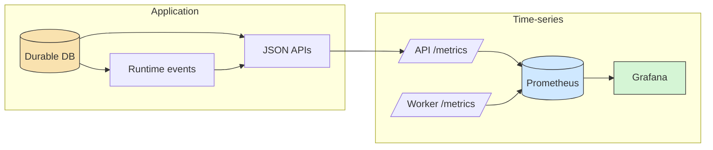
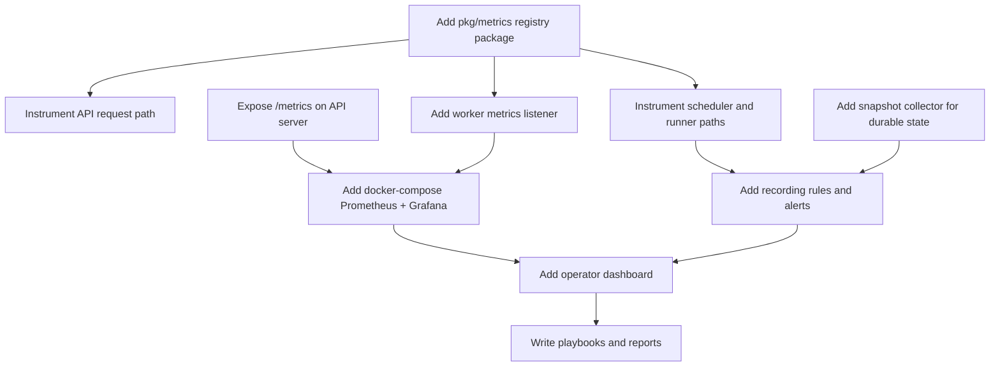

# Building Prometheus and Grafana into a Go application from scraper

This note captures a reusable pattern for adding Prometheus metrics and Grafana dashboards to a Go application, using the scraper repository as the concrete case study. The point is not only to remember what changed in scraper. The point is to preserve the implementation sequence, architectural boundaries, and failure-avoidance rules so the same approach can be reused in the next application without re-learning the same lessons.

> [!summary]
> The most important reusable ideas are:
> 1. keep Prometheus responsible for numeric time-series and alerts, but keep the application responsible for durable domain state
> 2. use an explicit metrics package and an explicit registry rather than scattering Prometheus code through handlers and workers
> 3. start with exporter endpoints and a local Prometheus/Grafana stack, then add recording rules and alerts only after the raw metrics are trustworthy
> 4. treat Grafana dashboards as an operator surface with a specific question model, not as a random pile of panels

## Why this note exists

It is easy to say “add Prometheus” and then end up with something shallow:

- a `/metrics` endpoint with a few counters,
- no real dashboard story,
- no alerting plan,
- high-cardinality labels,
- no boundary between Prometheus time-series and the app’s own object model,
- no durable write-up of how the system was built.

The scraper work avoided most of that by making explicit decisions early:

- scraper keeps workflows, ops, dependencies, artifacts, and runtime events as durable application state
- Prometheus only carries numeric time-series
- Grafana is the first historical operator UI
- the frontend remains a separate decision rather than being forced into the metrics work

That split is reusable in most workflow engines, job systems, API backends, and queue-driven Go services.

## When to use this pattern

Use this pattern when an application already has some internal state model and you want:

- throughput charts
- latency histograms
- backpressure and queue visibility
- alerting
- local and production-compatible dashboards

This pattern is especially appropriate when:

- there is both an API/control-plane process and a worker/execution process
- there are queues or rate limits
- the system already has a durable database and domain APIs
- there is a real operator use case rather than just developer curiosity

## Core mental model

The key architectural decision is to split observability into two layers instead of pretending one system can do both jobs.



The practical rule is:

- the application explains exact objects
- Prometheus explains behavior over time

If a future system has workflows/jobs/tasks/requests that users need to inspect individually, do not try to turn Prometheus into that database.

## Project context in scraper

The concrete repository was:

- `/home/manuel/workspaces/2026-03-23/js-scraper/scraper`

The important existing pieces before Prometheus work began were:

- API server in `pkg/api/server/`
- worker CLI in `pkg/cmd/worker.go`
- scheduler in `pkg/engine/scheduler/`
- SQLite engine store in `pkg/engine/store/sqlite/`
- durable queue/workflow inspection via `pkg/services/engineview/`
- runtime-event system already added in `pkg/runtimeevents/`

That context matters. It made Prometheus the third observability layer, not the first:

1. durable domain state
2. runtime events
3. time-series metrics

## Architecture pattern

The reusable implementation pattern that emerged looks like this:



That order is important. It is a safer build sequence than starting with dashboards or alerts.

## Implementation details

### 1. Build an explicit metrics package first

In scraper this became:

- `pkg/metrics/metrics.go`
- `pkg/metrics/http.go`
- `pkg/metrics/submission.go`
- `pkg/metrics/scheduler.go`
- `pkg/metrics/runner.go`
- `pkg/metrics/worker.go`
- `pkg/metrics/snapshot_collector.go`

The important design decision was to use a custom Prometheus registry, not the global default registry.

Why that helped:

- tests stayed isolated
- repeated server construction in tests did not double-register collectors
- worker and API processes could each own a clear metrics surface

Pseudocode:

```text
func NewRegistry() *Registry:
  create prometheus.Registry
  register Go collector
  register process collector
  create all application counters/gauges/histograms
  register them
  return explicit Registry wrapper
```

### 2. Instrument the API server and worker separately

In scraper:

- API exporter lives on the main server mux
- worker exporter lives on a dedicated small HTTP server started from the worker command

The worker side is easy to forget because workers are often CLIs rather than HTTP servers. Scraper solved that by adding worker flags:

- `--metrics-address`
- `--metrics-path`

### 3. Separate snapshot gauges from streaming counters

There were two kinds of metrics:

- direct runtime metrics from hot paths
- current-state metrics derived from the durable DB

Examples:

- runtime counters:
  - workflow submissions
  - scheduler cycles
  - retries
  - failures
  - rate-limit events
- snapshot gauges:
  - current workflow totals by status
  - current queue depth
  - current token counts
  - current artifact/result counts

Scraper implemented the snapshot side via a scrape-time collector backed by `engineview.Service` and SQLite inspection helpers.

### 4. Measure queue wait from leaseability, not creation time

A naive queue-wait metric would use:

```text
now - op.created_at
```

That is wrong in many real job systems because an op may:

- wait on dependencies before it is runnable
- be retried later after a backoff window
- re-enter the ready state after lease expiration

Scraper fixed this by measuring queue wait from the durable time the op became leaseable:

- `updated_at` when the store transitioned the op into `ready`
- `max(updated_at, next_attempt_at)` for retryable failures

Pseudocode:

```text
func ReadyAt(op):
  readyAt = op.updated_at
  if op.next_attempt_at exists and op.next_attempt_at > readyAt:
    readyAt = op.next_attempt_at
  if readyAt is zero:
    readyAt = op.created_at
  return readyAt
```

### 5. Add recording rules and alerts only after raw metrics are trustworthy

The scraper rule bundle ended up with:

- ops completion rate
- queue rate-limit rate
- API request rate
- retry rate
- queue wait p95
- alerts for workers, API availability, throttling, failures, retries, and queue wait

The safe sequence is:

1. exporter endpoints
2. raw Prometheus queries
3. dashboard
4. recording rules
5. alerts
6. response playbook

## Common failure modes

### Treating Prometheus as the application database

Avoid labels like:

- `workflow_id`
- `op_id`
- `request_id`
- `artifact_id`

Use bounded labels instead:

- `site`
- `queue`
- `runner`
- `status`
- `status_class`
- `verb`

### Starting with dashboards instead of metrics semantics

If you build panels before you know what the metrics mean, you get pretty noise.

### Measuring queue time from the wrong timestamp

Creation time is often not the same as time spent waiting in a leaseable queue.

### Ignoring the worker process

Many applications add API metrics and forget the worker. In a job system, that gives you the control plane but not the execution plane.

### No local compose story

If Prometheus and Grafana are only “production ideas,” the system will not be exercised properly during development.

## Recommended implementation sequence for the next application

1. Decide the boundary between durable application state and time-series metrics.
2. Add an explicit `pkg/metrics` package with a custom registry.
3. Expose `/metrics` in the API process.
4. Expose `/metrics` in worker processes.
5. Instrument request, scheduler, runner, and submission paths.
6. Add a snapshot collector from durable state.
7. Create a local Prometheus + Grafana compose stack.
8. Verify raw exporters before writing any dashboard.
9. Build a first Grafana dashboard around concrete operator questions.
10. Add recording rules and alerts.
11. Write an operator playbook and a post-implementation article like this one.

## Practical commands

```bash
docker compose up -d redis prometheus grafana

tmux new-session -d -s app-api \
  "go run ./cmd/app api serve --address 0.0.0.0:8080 ..."

tmux new-session -d -s app-worker \
  "go run ./cmd/app worker run --metrics-address 0.0.0.0:9091 ..."

curl -s http://127.0.0.1:8080/metrics
curl -s http://127.0.0.1:9091/metrics
curl -s http://127.0.0.1:9090/api/v1/targets
curl -s http://127.0.0.1:9090/api/v1/rules
```

## Working rules

- Keep Prometheus for numeric behavior, not object inspection.
- Use bounded labels only.
- Give workers their own exporter endpoint.
- Prefer scrape-time snapshot collectors over manual gauges when durable state already exists.
- Build dashboards around operator questions, not metric completeness.
- Add alerts only after raw metrics and dashboard behavior are trustworthy.
- Write the playbook while the implementation details are still fresh.

## Related repo docs

- [01-prometheus-metrics-architecture-and-implementation-guide-for-operator-observability.md](./01-prometheus-metrics-architecture-and-implementation-guide-for-operator-observability.md)
- [../playbook/01-local-prometheus-and-grafana-smoke-test.md](../playbook/01-local-prometheus-and-grafana-smoke-test.md)
- [../playbook/02-metrics-and-grafana-operator-guide.md](../playbook/02-metrics-and-grafana-operator-guide.md)
