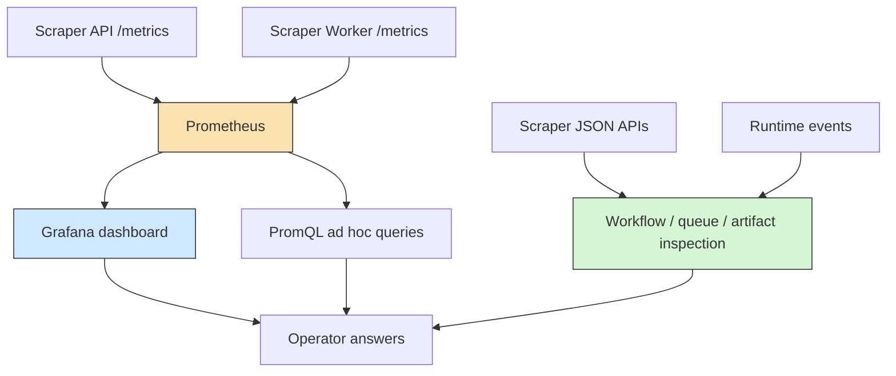

# Metrics and Grafana operator guide

## Purpose

This guide explains the metrics that scraper exports, how to inspect them directly in Prometheus, how to read the starter Grafana dashboard, and what operational questions each metric family is meant to answer.

The main idea is simple:

- scraper API metrics answer “what is the system serving and what is its current durable state?”
- scraper worker metrics answer “what is the scheduler and execution layer doing over time?”
- Grafana turns those raw time-series into a fast operator view
- runtime events and workflow APIs still answer the detailed “why did this exact workflow/op behave this way?” questions

Prometheus is not the source of truth for workflows, ops, dependencies, or artifacts. It is the source of truth for numeric behavior over time.

## Mental model

You should think about scraper observability as three layers:



Use the metrics layer when the question is:

- Is throughput rising or falling?
- Are queues backing up?
- Are retries spiking?
- Is one queue much slower than the others?
- Is the worker alive?
- Are failure rates increasing over time?

Use the scraper APIs and runtime events when the question is:

- Why did this exact workflow fail?
- Which op is blocked?
- What dependency prevented progress?
- What artifact did a specific op emit?

## Where to view the metrics

There are three normal ways to look at metrics.

### 1. Raw exporter endpoints

Use these when debugging whether the application is exporting metrics at all.

- API exporter: `http://127.0.0.1:8080/metrics`
- worker exporter: `http://127.0.0.1:9091/metrics`

Example checks:

```bash
curl -s http://127.0.0.1:8080/metrics | rg 'scraper_http_requests_total|scraper_engine_workflow_status_total'
curl -s http://127.0.0.1:9091/metrics | rg 'scraper_workers_up|scraper_scheduler_cycles_total|scraper_queue_wait_seconds'
```

Use this layer first when Prometheus shows missing data, because it lets you separate “exporter is broken” from “Prometheus is broken”.

### 2. Prometheus API and UI

Use Prometheus when you want the exact metric series or to verify recording rules and alert rules.

- Prometheus UI/API: `http://127.0.0.1:9090`

Useful checks:

```bash
curl -s http://127.0.0.1:9090/api/v1/targets | jq '.data.activeTargets[] | {job: .labels.job, health: .health}'
curl -s 'http://127.0.0.1:9090/api/v1/query?query=scraper_workers_up'
curl -s 'http://127.0.0.1:9090/api/v1/query?query=scraper:queue_wait_p95_15m'
curl -s http://127.0.0.1:9090/api/v1/rules | jq '.data.groups[].rules[] | {name: .name, type: .type}'
```

Use Prometheus when you want truth at the query level.

### 3. Grafana dashboard

Use Grafana when you want a fast operator overview rather than raw series.

- Grafana: `http://127.0.0.1:3000`
- default local credentials: `admin` / `admin`
- starter dashboard: `Scraper Overview`

The Grafana dashboard is meant to answer “what is hot right now?” without you writing PromQL from scratch.

## Metric families and what they mean

### API request metrics

Metrics:

- `scraper_http_requests_total{method,route,status_class}`
- `scraper_http_request_duration_seconds{method,route,status_class}`

These describe the scraper API server itself, not worker-side runner requests.

Use them to answer:

- which routes are being exercised?
- is the API healthy or overloaded?
- are API latencies increasing?

They are useful for infrastructure and control-plane health, not scraping throughput.

### Workflow submission metrics

Metrics:

- `scraper_workflows_submitted_total{site,verb}`
- `scraper_submission_failures_total{site,verb,error_code}`

These tell you whether users or systems are successfully creating work.

Use them to answer:

- are new workflows entering the system?
- are submit verbs failing validation?
- are users targeting missing sites or verbs?

Typical error codes:

- `not_found`
- `validation_error`
- `internal_error`

### Engine snapshot gauges

Metrics:

- `scraper_engine_workflows_total`
- `scraper_engine_workflow_status_total{status}`
- `scraper_engine_ops_total{status}`
- `scraper_engine_leases_total{state}`
- `scraper_engine_results_total`
- `scraper_engine_artifacts_total`
- `scraper_queue_state_total{site,queue,state}`
- `scraper_queue_tokens{site,queue}`

These come from the API-side snapshot collector and represent durable current state, not rates.

Use them to answer:

- how many workflows are pending/running/succeeded/failed right now?
- how much work is ready vs running?
- is a queue filling up?
- is the token bucket drained?

These are the bridge between scraper’s durable DB state and the time-series world.

### Scheduler activity metrics

Metrics:

- `scraper_scheduler_cycles_total{worker_id}`
- `scraper_scheduler_cycle_duration_seconds{worker_id}`
- `scraper_ops_leased_total{site,queue,runner}`
- `scraper_op_retries_total{site,queue,runner}`
- `scraper_op_failures_total{site,queue,runner,error_code}`
- `scraper_queue_rate_limited_total{site,queue}`
- `scraper_queue_wait_seconds{site,queue,runner}`

These are the heart of operator usefulness. They show whether the worker is making progress, whether queues are constrained, and how long work waits after it becomes leaseable.

Use them to answer:

- is the scheduler alive and cycling?
- which queues are actually being leased?
- are retries becoming common?
- are failures concentrated in one queue or runner?
- are queues slow because of backlog or because work cannot be leased?

### Runner metrics

Metrics:

- `scraper_op_duration_seconds{site,queue,runner,status}`
- `scraper_http_runner_requests_total{site,queue,status_class}`
- `scraper_http_runner_duration_seconds{site,queue,status_class}`

These measure execution behavior rather than scheduling behavior.

Use them to answer:

- is one runner kind slow?
- are HTTP fetches failing as `4xx`, `5xx`, or transport errors?
- are operations succeeding slowly or quickly?

This is where you start separating queueing problems from runner/external-service problems.

### Worker liveness

Metric:

- `scraper_workers_up{worker_id}`

This is a very direct indicator: if the worker metrics listener is up and exporting, the gauge should be `1`.

Use it with Prometheus target health:

- `up{job="scraper-worker"}`
- `scraper_workers_up`

Those are related but not identical:

- `up` tells you whether Prometheus can scrape the target
- `scraper_workers_up` tells you whether the worker process believes it is up

## Recording rules and what they are for

### `scraper:ops_completed_rate5m`

Purpose:

- quick throughput view for completed ops by site/queue/runner/status

### `scraper:queue_rate_limited_rate5m`

Purpose:

- normalized view of queue throttling frequency

### `scraper:http_requests_rate5m`

Purpose:

- clean control-plane request rate aggregation

### `scraper:op_retries_rate5m`

Purpose:

- normalized retry behavior by site/queue/runner

### `scraper:queue_wait_p95_15m`

Purpose:

- the best single “is this queue healthy?” latency indicator currently implemented

## How to read the Grafana dashboard

### Top-row stats

- `Workers Up`
  - should be stable and non-zero
  - if zero, either the worker is not running or metrics are not reachable
- `Active Workflows`
  - snapshot of pending + running workflows
  - useful for “are we idle or actively processing?”
- `Ready Queue Depth`
  - how much work is currently waiting to be leased
  - if this rises while completions stay flat, the system is backlogging
- `Worst Queue Wait P95`
  - the single worst current queue wait p95
  - a fast “is anything stuck?” indicator

### Throughput row

- `Workflow Submit Rate`
- `Op Completion Rate`

If submit rate is high and completion rate is low, backlog or execution trouble is growing.

### Queue health row

- `Current Queue State`
- `Queue Wait P95`

Read these together:

- high `ready` + high queue wait = not enough worker/queue capacity, or queue is being constrained
- low `ready` + high queue wait can mean sporadic but severe stalls or backoff/retry behavior

### Failure and pressure row

- `Retry Rate`
- `Failure Rate by Error Code`
- `Queue Rate Limit Events`

### Bottom row

- `P95 Op Duration`
- `Workflow Status Totals`
- `API Request Rate`

## Common operator investigations

### “The system feels stuck”

Look at:

- `Workers Up`
- `Current Queue State`
- `Queue Wait P95`
- `Op Completion Rate`

Then move to scraper APIs and runtime events for the exact workflows involved.

### “One site is failing a lot”

Look at:

- `Failure Rate by Error Code`
- `Retry Rate`
- `P95 Op Duration`

Interpretation:

- `http_4xx` often points to bad requests, changed pages, or auth/input issues
- `http_5xx` often points to upstream instability
- `transport_error` often points to networking or proxy trouble

### “The queue is slow but not obviously failing”

Look at:

- `Queue Wait P95`
- `Current Queue State`
- `Queue Rate Limit Events`
- `P95 Op Duration`

## Useful PromQL queries

Current workflow state:

```promql
sum by (status) (scraper_engine_workflow_status_total)
```

Current ready work by queue:

```promql
sum by (site, queue) (scraper_queue_state_total{state="ready"})
```

Worst queue wait p95:

```promql
topk(10, scraper:queue_wait_p95_15m)
```

Retry-heavy queues:

```promql
topk(10, scraper:op_retries_rate5m)
```

Failure-heavy queues:

```promql
topk(10, sum by (site, queue, runner, error_code) (rate(scraper_op_failures_total[10m])))
```

Slow operations:

```promql
histogram_quantile(0.95, sum by (le, site, queue, runner, status) (rate(scraper_op_duration_seconds_bucket[5m])))
```

## Recommended debugging sequence

1. Check raw exporter endpoints.
2. Check Prometheus target health.
3. Check the relevant Grafana panels.
4. Run focused PromQL if the panel is too aggregated.
5. Move into scraper workflow APIs and runtime events for the exact failing workflows.

## Related docs

- [01-local-prometheus-and-grafana-smoke-test.md](./01-local-prometheus-and-grafana-smoke-test.md)
- [../design-doc/01-prometheus-metrics-architecture-and-implementation-guide-for-operator-observability.md](../design-doc/01-prometheus-metrics-architecture-and-implementation-guide-for-operator-observability.md)
