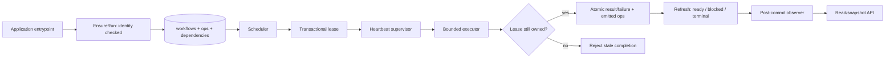
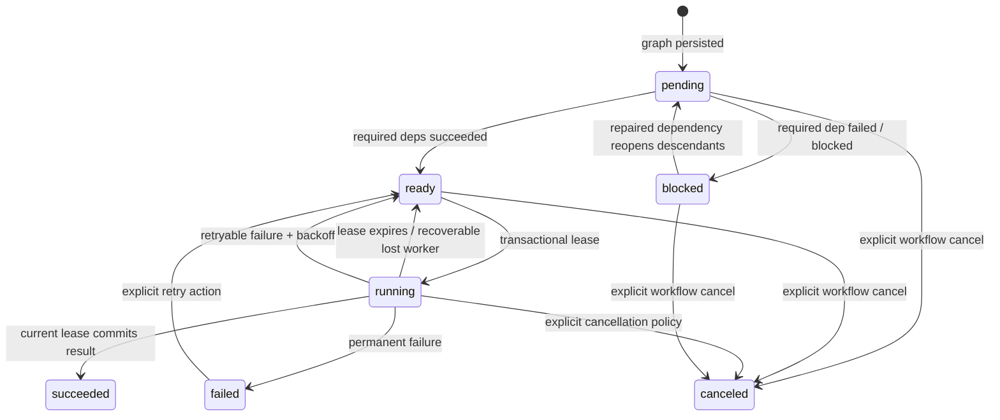

# Long-running resumable workflow hardening architecture and implementation guide

## Executive summary

Scraper is already a durable workflow engine, not merely a web-scraping tool. Its SQLite engine store persists workflow graphs, operation state, dependencies, leases, results, artifacts, and queue limiter state. Its scheduler turns ready operations into leases, its runners execute them, and its workflow package exposes an embeddable Go facade. That is a strong foundation for long-running batch work such as RAG preparation, ingestion, expensive enrichment, media processing, or any job where restarting from zero is unacceptable.

However, version `v0.0.4` must be hardened before it becomes the execution authority for expensive provider-backed work. Investigation, tests, and executable probes establish these defects and constraints:

1. **No scheduler-managed lease heartbeat.** The store exposes `HeartbeatLease`, but `Scheduler.executeLeasedOp` never calls it. Long work can outlive its lease and be acquired by another worker.
2. **Stale workers can commit.** `CompleteOp` and `FailOp` mutate the operation/result before testing whether lease deletion matched the token. The stale-completion probe proves an old worker can mark a re-leased operation succeeded.
3. **Repeated heartbeat is not cumulative.** `HeartbeatLease` bases every extension on the original lease supplied by the caller. Two heartbeats with the same `Lease` do not extend twice.
4. **SQLite timestamp comparison is unsafe at mixed RFC3339Nano precision.** Timestamp strings such as `...01Z` and `...01.5Z` do not sort chronologically as TEXT. The probe proves that an expired lease may remain running.
5. **Dependency-derived cancellation is irreversible.** `RefreshRunnableOps` turns descendants of failed dependencies into `canceled`; operator retry reopens only the failed node. A repaired dependency leaves its finalizer canceled forever.
6. **Single-process concurrency is not real.** `MaxWorkers` bounds how many operations a scheduler cycle processes, but `RunOnce` executes every lease synchronously. Three 100 ms jobs measured `max_active=1` and about 317 ms.
7. **The public workflow facade hides needed controls.** `workflow.Config` cannot receive a scheduler observer, and `StartRun` has no canonical-identity create-or-attach contract.
8. **Cycle counters are misleading.** `CycleResult.Succeeded`, `Retried`, and `Failed` are declared but not incremented.

The recommended design keeps scraper generic. It does **not** add RAG schemas, provider recovery policy, Goja EventEmitter APIs, researchctl persistence, dashboard transport, or Redis deployment policy to this repository. Instead, scraper must provide generic correctness primitives that all domains need:

- loss-detecting, scheduler-managed leases;
- a distinct recoverable `blocked` operation state;
- transitive dependency reactivation under explicit operator control;
- true bounded in-process concurrency with durable queue limits;
- immutable-identity `EnsureRun`;
- safe, post-commit scheduler observer delivery;
- durable aggregate inspection APIs;
- truthful cycle accounting and safe time persistence.

The high-level result is:



This ticket is an implementation guide and task plan. It does not authorize unbounded live provider workloads. The correct rollout is fixture-first, crash/restart-tested, bounded in concurrency and cost, then released as a new scraper version before a consumer pins it.

> **Implementation status (2026-07-20):** The core hardening design is implemented in commits `b80babf`, `3126c7c`, `9d35921`, and `cdb6fe7`. Scraper now uses migration 003 epoch-microsecond scheduling columns; token-verified lease transitions and scheduler heartbeats; recoverable `blocked` dependencies; bounded concurrent runner execution; `EnsureRun`; guarded workflow observers; correct cycle counts; and durable snapshot APIs. See [the rollout runbook](../playbooks/01-rollout-and-operator-runbook.md) for operational compatibility and validation steps. The guide’s descriptions of former defects remain historical evidence for regression tests.

## 1. Orientation for a new intern

### 1.1 What scraper owns

Scraper owns generic durable execution:

- workflow and operation persistence;
- dependency readiness;
- leasing and expired-lease recovery;
- operation result/artifact persistence;
- retry scheduling;
- queue in-flight and token-bucket policy;
- scheduler/worker lifecycle;
- operator retry/cancel actions;
- inspection APIs and runtime events.

The primary code path is:

```text
application / submit verb
  -> CreateWorkflow(workflow + initial ops)
  -> SQLite transaction persists graph

worker / embedded Runtime
  -> RefreshRunnableOps
  -> ListQueueCandidates
  -> LeaseReadyOp
  -> runner.Run
  -> CompleteOp or FailOp
  -> RefreshRunnableOps
  -> workflow-status refresh
```

Read these files in this order:

1. `pkg/engine/model/types.go` — durable domain state.
2. `pkg/engine/store/store.go` — storage contract.
3. `pkg/engine/store/sqlite/migrations/001_engine_core.sql` and `002_engine_runtime.sql` — physical schema.
4. `pkg/engine/store/sqlite/op_store.go` and `lease_store.go` — readiness and leasing.
5. `pkg/engine/store/sqlite/result_store.go` — result/failure commits.
6. `pkg/engine/scheduler/scheduler.go` — orchestration and state updates.
7. `pkg/services/engineview/workflow_mutation_service.go` — existing operator actions.
8. `pkg/workflow/runtime.go` — embeddable facade.
9. `pkg/cmd/worker_runtime.go` — CLI worker composition.

### 1.2 What a workflow and operation mean

`model.WorkflowRun` is a durable run with a stable ID, site/domain, name, status, input, metadata, and timestamps. `model.OpSpec` is one durable unit of work with a stable operation ID, kind, queue, input, retry policy/state, dependencies, and metadata.

An operation is intentionally the recovery boundary. A batch that calls one provider request should normally be one operation. A successful operation persists independently; a failed operation has a stable ID and error record; a finalizer is another operation depending on all required batch operations.

The engine must **not** infer that an operation is safe to rerun. At-least-once execution is unavoidable around a crash or lease loss. Application executors must use stable identities and idempotent outputs where possible. The engine's job is to prevent obvious stale commits and minimize unnecessary duplicates.

### 1.3 State machines

Current operation states are `pending`, `ready`, `running`, `succeeded`, `failed`, and `canceled`. The design adds `blocked`.



Important distinctions:

- **failed** means this operation itself ran and returned a terminal failure.
- **blocked** means it did not run because a required upstream operation prevents progress; it is eligible to reopen after repair.
- **canceled** means an operator or explicit workflow-cancellation policy stopped it. It must not be reopened incidentally.
- **ready** has no active lease; **running** has exactly one non-expired lease token.

Workflow status remains a summary derived from operation states. It is not a substitute for operation state. A workflow can be `running` while one operation is failed if independent operations remain runnable; a workflow becomes terminal only after no work can progress under the defined policy.

## 2. Evidence-backed current state

### 2.1 Current schema and store contracts

The migrations create `workflows`, `ops`, `op_dependencies`, `leases`, `queue_limit_state`, `results`, and `artifacts`. `Store` offers `CreateWorkflow`, operation enqueue/read/lease/heartbeat/complete/fail, `RefreshRunnableOps`, queue candidate listing, result reads, and `GetWorkflowStats`.

This is enough to implement durable work. It is not enough yet to express blocked state, atomic create-or-attach, loss-detecting heartbeat results, or incremental event history.

Current `WorkflowStats` has `Pending`, `Ready`, `Running`, `Succeeded`, `Failed`, and `Canceled`; it needs `Blocked`. `EngineStatus` counts operation statuses and will naturally need to include it after model/schema changes.

### 2.2 Scheduler execution is sequential

`Scheduler.RunOnce` leases an operation and immediately calls `executeLeasedOp` before leasing the next operation. `MaxWorkers` limits loop work but does not create goroutines or an executor pool.

Ticket probe `scripts/02-probe-single-process-concurrency.go` used three 100 ms operations, `MaxWorkers=3`, and queue `MaxInFlight=3`. It observed:

```text
processed=3 max_active=1 elapsed_ms=317
```

The expected post-hardening observation is approximately:

```text
processed=3 max_active=3 elapsed_ms=100..180
```

The acceptance test must assert maximum concurrency, not merely elapsed time, because timing alone is flaky.

### 2.3 Dependency failure cancels finalizers permanently

`RefreshRunnableOps` repeatedly changes `pending` descendants to `canceled` when a required dependency is failed or canceled. `engineview.Service.RetryOp` updates only the failed row to `ready`. It does not reopen descendants.

Ticket probe `scripts/01-probe-retry-descendants.go` observed:

```text
first cycle: processed=2 succeeded=0 failed=0
workflow=failed batch-a=failed batch-b=succeeded finalize=canceled
after manual retry: processed=1 succeeded=0 failed=0
workflow=failed batch-a=succeeded batch-b=succeeded finalize=canceled
```

Two additional defects are visible in the same output: independent sibling work correctly continues, but cycle success/failure counters remain zero.

### 2.4 Lease safety is incomplete

`LeaseReadyOp` inserts a token and marks an operation `running` transactionally. This is a good start. The current implementation, however, has four correctness holes:

1. `Scheduler.executeLeasedOp` does no heartbeat while a runner executes.
2. `HeartbeatLease` updates only by `(op_id, token)`, does not require a running state/nonexpired lease, does not inspect rows affected, and computes `newExpiry := callerLease.ExpiresAt + extendBy`.
3. `CompleteOp` inserts the result and marks the operation succeeded regardless of whether `DELETE FROM leases WHERE op_id=? AND token=?` deleted a row.
4. `FailOp` updates the result/status before it deletes the lease by token, with the same missing ownership check.

Ticket probe `scripts/03-probe-stale-lease-completion.go` demonstrates both cumulative heartbeat and stale-commit failure:

```text
after two heartbeats: status=running lease=worker=worker-1 expires=2026-07-20T18:00:02.123456789Z
re-leased: old_token=worker-1:... new_token=worker-2:...
stale completion error=<nil>
after stale completion: status=succeeded lease=worker=worker-2 expires=...
current completion error=<nil>
```

The stale worker succeeded even though worker 2 owns the current lease. It also left an orphaned active lease beside a succeeded operation. This is a release-blocking correctness defect.

### 2.5 RFC3339Nano TEXT values do not preserve chronological order

The store serializes time as `time.RFC3339Nano` strings. That format suppresses fractional trailing zeros. SQLite compares the stored values as TEXT in predicates such as `expires_at <= ?`.

The time-ordering probe observes:

```text
expires=2026-07-20T18:00:01Z refresh_at=2026-07-20T18:00:01.5Z chronological_expired=true lexical_expired=false
refresh_changed=0 status=running lease_present=true
```

The chronology is correct in Go, but lexical comparison is false because `Z` sorts after `.`. This can prevent expired leases or backoff times from becoming runnable. This guide therefore adds timestamp normalization as a first-class hardening task, not a cosmetic cleanup.

### 2.6 Existing runtime events solve a different layer

Scraper already has rich event infrastructure:

- `scheduler.Observer` and `scheduler.Event`;
- protobuf `RuntimeEventV1` in `proto/scraper/runtime/v1/events.proto`;
- `pkg/runtimeevents` mapping and publication;
- sessionstream runtime, snapshots, and WebSocket route;
- optional Watermill Redis Streams backend.

The active `SCRAPER-SESSIONSTREAM-EVENTS` ticket owns browser-facing distribution. This ticket owns **engine correctness and generic observer semantics**. It must preserve compatibility with current `RuntimeEventV1` mapping, but it must not redesign sessionstream, WebSocket, Goja, or Redis.

## 3. Target design

### 3.1 Design principles

1. Every durable state transition has one transactional source of truth.
2. Completion/failure may commit only while the caller still owns a live lease.
3. Long-running runner work receives a derived cancelable context and periodic scheduler-managed heartbeat.
4. Independent work proceeds after a sibling fails; dependency-derived blocking remains recoverable.
5. Bounded concurrency is real in one process and queue limits remain globally durable through SQLite.
6. Stable canonical identity makes attachment safe; an ID collision with different identity is an error.
7. Observers see post-commit facts and cannot stall or crash the scheduler.
8. Read APIs reconstruct authoritative counts from the store, not from event counters.
9. Timestamps used in SQL comparisons have one sortable representation.
10. Engine interfaces stay domain-neutral.

### 3.2 Result of a lost lease

A lost lease means the runner cannot safely write the operation result. The scheduler must cancel its derived execution context and return a classified `ErrLeaseLost`/`ErrStaleLease` outcome. It must not call `CompleteOp` or `FailOp` with a token that failed heartbeat.

The runner may already have caused an external side effect. The engine cannot make an arbitrary provider HTTP call exactly once. The executor should use idempotency keys, content-addressed output, or provider/client deduplication where available. The engine guarantees only that stale owners do not overwrite the durable engine record.

### 3.3 Time representation

Adopt INTEGER epoch microseconds or nanoseconds for every SQL-comparison timestamp. This guide recommends **epoch microseconds** because it is well within signed 64-bit range and sufficient for scheduler leases/backoff; it remains sortable and indexable.

Use columns such as:

```text
created_at_us
updated_at_us
next_attempt_at_us
lease_acquired_at_us
lease_expires_at_us
completed_at_us
```

Public Go APIs still use `time.Time`. Formatting to RFC3339Nano occurs only at JSON/log/API boundaries. Do not compare RFC3339 strings in SQL.

Migration needs careful treatment because v0.0.4 data contains textual timestamps. SQL alone cannot safely normalize all Go RFC3339Nano variants. Extend the migration runner with a versioned Go data migration hook:

```go
type migration struct {
    Version int
    Name    string
    SQL     string
    Backfill func(ctx context.Context, tx *sql.Tx) error
}
```

The hook parses legacy time text with `time.Parse(time.RFC3339Nano, value)` and fills new integer columns transactionally. New queries use only integer columns after migration. A migration test must seed both `...01Z` and `...01.5Z` values.

### 3.4 Leases and heartbeat API

Replace the ambiguous heartbeat signature with a request/result contract:

```go
type HeartbeatRequest struct {
    OpID          model.OpID
    Lease         model.Lease
    Now           time.Time
    LeaseDuration time.Duration
}

type HeartbeatResult struct {
    Lease model.Lease
}

var ErrLeaseLost = errors.New("workflow lease lost")

func (s *Store) HeartbeatLease(
    ctx context.Context,
    req HeartbeatRequest,
) (HeartbeatResult, error)
```

The update must be conditional and inspect `RowsAffected`:

```sql
UPDATE leases
SET expires_at_us = :now_us + :lease_duration_us
WHERE op_id = :op_id
  AND token = :token
  AND expires_at_us > :now_us
  AND EXISTS (
      SELECT 1 FROM ops
      WHERE ops.id = leases.op_id AND ops.status = 'running'
  );
```

Zero affected rows returns `ErrLeaseLost`. A successful result returns the new expiration, and the heartbeat supervisor stores it for diagnostics. Each heartbeat extends from `Now`, not an old copied `Lease.ExpiresAt`.

Use a validated heartbeat cadence:

```go
HeartbeatInterval = min(LeaseDuration / 3, configuredMax)
require HeartbeatInterval > 0 && HeartbeatInterval < LeaseDuration
```

Do not issue a heartbeat after the executor has reported completion. Stop and wait for the heartbeat goroutine before committing. This avoids a heartbeat racing the final transactional completion.

### 3.5 Atomic completion/failure

Completion must first claim the live lease in its transaction, then write results:

```text
BEGIN IMMEDIATE
  SELECT token, expires_at_us FROM leases WHERE op_id = ?
  verify token == completion token and expiry > now
  verify ops.status == running
  DELETE current lease
  insert result/artifacts/emitted ops
  update op succeeded
COMMIT
```

Failure follows the same lease-ownership precondition. The operation changes to `ready` with next-attempt time for automatic retry or `failed` for terminal failure. Never write a result before ownership is verified.

API sketch:

```go
type Completion struct {
    Lease model.Lease
    Now   time.Time
    Result model.OpResult
}

func CompleteOp(ctx context.Context, opID model.OpID, c Completion) error
func FailOp(ctx context.Context, opID model.OpID, f Failure) error
```

Return a typed `ErrLeaseLost` that callers recognize. Do not convert it into a retryable domain failure or overwrite an operation error from the new owner.

### 3.6 Scheduler-managed heartbeat supervision

Pseudocode:

```go
func (s *Scheduler) executeLeasedOp(parent context.Context, op OpSpec, lease Lease, now time.Time) error {
    runCtx, cancelRun := context.WithCancel(parent)
    defer cancelRun()

    heartbeatCtx, stopHeartbeat := context.WithCancel(parent)
    heartbeatDone := make(chan struct{})
    leaseLost := atomic.Bool{}

    go func() {
        defer close(heartbeatDone)
        ticker := time.NewTicker(s.heartbeatInterval())
        defer ticker.Stop()
        for {
            select {
            case <-heartbeatCtx.Done(): return
            case tick := <-ticker.C:
                _, err := s.store.HeartbeatLease(heartbeatCtx, HeartbeatRequest{
                    OpID: op.ID, Lease: lease, Now: tick, LeaseDuration: s.config.DefaultLeaseDuration,
                })
                if errors.Is(err, store.ErrLeaseLost) {
                    leaseLost.Store(true)
                    cancelRun()
                    return
                }
                if err != nil { report operational error; cancelRun(); return }
            }
        }
    }()

    result, runErr := runner.Run(runCtx, runContext)
    stopHeartbeat()
    <-heartbeatDone

    if leaseLost.Load() { return ErrLeaseLost }
    if runErr != nil { return s.failLeasedOp(parent, op, lease, s.now(), classify(runErr)) }
    return s.completeLeasedOp(parent, op, lease, s.now(), result)
}
```

The exact error policy for transient heartbeat database errors needs a decision record. The conservative default is to stop execution and avoid commit; a temporary DB failure otherwise risks unsafe double ownership.

### 3.7 Recoverable blocking and reactivation

Add `OpStatusBlocked`. `RefreshRunnableOps` should be declarative and idempotent:

```text
required dependency failed or blocked -> blocked
all required dependencies succeeded and optional dependencies terminal -> ready
explicitly canceled -> never changed by refresh
```

A direct retry action does more than `UPDATE failed SET ready`. It runs one transactional recovery algorithm:

```text
RetryOp(workflow, failedOp):
  verify target is failed
  clear terminal error/result only if policy permits (preserve attempt history separately)
  target -> ready
  traverse required descendants currently blocked
  for each descendant in reverse topological order:
      if all required dependencies now succeeded or retryable/runnable under policy:
          blocked -> pending
  recompute readiness
  workflow -> running if it has nonterminal work
```

The precise condition matters. A finalizer depending on one repaired batch and one still-failed batch must remain blocked. Do not reopen children of explicitly canceled operations. Do not make retry a generic “reset the graph” operation.

For scalable graphs, use a recursive CTE in SQLite or an iterative breadth-first query with visited IDs. The result must be deterministic, bounded to the workflow, and transactionally applied.

### 3.8 True bounded concurrency

Keep `RunOnce` synchronous from the caller's perspective: it returns after the leased work for that cycle completes. Change its internals to lease and execute concurrently up to `Config.MaxWorkers`.

Fair leasing policy:

1. Refresh state once before leasing.
2. List candidate `(site, queue)` pairs in deterministic order.
3. Round-robin candidates, leasing at most one operation per candidate per pass.
4. Stop after global capacity is leased or a pass makes no progress.
5. Dispatch each lease immediately into an `errgroup`/bounded worker pool.
6. Wait for all dispatched work.
7. Refresh affected workflow statuses once after all work settles.

```go
func (s *Scheduler) RunOnce(ctx context.Context) (*CycleResult, error) {
    candidates := sortedCandidates(...)
    jobs := make(chan leasedJob)
    group, groupCtx := errgroup.WithContext(ctx)

    for n := 0; n < s.config.MaxWorkers; n++ {
        group.Go(func() error {
            for job := range jobs {
                outcome := s.executeLeasedOp(groupCtx, job.op, job.lease, s.now())
                recordOutcome(outcome)
            }
            return nil
        })
    }

    leaseFairlyInto(jobs, candidates, s.config.MaxWorkers)
    close(jobs)
    err := group.Wait()
    refreshWorkflowStatuses(affected)
    return result, err
}
```

Do not hold a scheduler-wide mutex while a runner executes. Queue admission remains durable because `LeaseReadyOp` checks active leases and token-bucket state transactionally. Global per-process capacity is enforced by the pool. Cross-process capacity is still governed by queue `MaxInFlight` in SQLite.

`CycleResult` needs concurrency-safe atomics or a result channel. Count a leased operation as `Processed`; count terminal success as `Succeeded`; count scheduled automatic retry as `Retried`; count terminal failure as `Failed`. Lost leases are operational outcomes, not successful retries.

### 3.9 Canonical `EnsureRun`

`Runtime.StartRun` always creates a new workflow. Long-running reusable work needs an idempotent attach API:

```go
type EnsureRunOptions struct {
    ID       string
    Name     string
    Metadata map[string]string
    Identity any // marshaled as canonical JSON
}

type RunHandle struct {
    ID       model.WorkflowID
    Package  string
    Name     string
    IdentityDigest string
    Created  bool
}

func (rt *Runtime) EnsureRun(
    ctx context.Context,
    packageName string,
    input any,
    opts EnsureRunOptions,
) (*RunHandle, error)
```

Semantics:

- caller supplies a stable workflow ID or one deterministically derived from identity;
- runtime canonicalizes identity JSON and computes a digest;
- workflow metadata persists the identity schema and digest;
- if the workflow does not exist, build and create it transactionally;
- if it exists with the same package and exact identity digest, return `Created=false` without calling entrypoint;
- if it exists with a different identity, return `ErrWorkflowIdentityConflict`;
- no “best effort” matching by name, dedup key, or input subset.

The store must enforce this transactionally. A `workflows.identity_digest` column with a unique constraint is preferable to a read-then-create race. If package/site and workflow ID are always one-to-one, a primary-key collision query can compare the stored digest under the same transaction.

Identity contains only stable, safe values such as version/schema, input artifact digest, pipeline/model configuration digest, and recovery policy version. It must not contain secrets or raw source content.

### 3.10 Observers and snapshots

Add observer support to `workflow.Config`:

```go
type Config struct {
    // existing fields
    Observer scheduler.Observer
}
```

`NewRuntime` passes it to `scheduler.New`. Add a generic composite/guarded observer utility:

```go
type ObserverPolicy struct {
    RecoverPanics bool
    ReportError   func(error)
}

func GuardObserver(next Observer, policy ObserverPolicy) Observer
func ComposeObservers(observers ...Observer) Observer
```

Observer rules:

- events are emitted only after their state transaction commits;
- observer execution may not change scheduling state;
- observer panic is recovered and reported;
- no unbounded per-event goroutine is created by the scheduler;
- observer code must return promptly; transport adapters own bounded queues;
- scheduler event payload remains generic and redacted.

Scraper already maps scheduler events into `RuntimeEventV1` and sessionstream/Redis infrastructure. Maintain that mapping. Add generic event kinds only when an engine transition needs one, such as `op_blocked`, `op_unblocked`, and `lease_lost`; update the protobuf schema in the related runtime-event work rather than hiding state in untyped message text.

Add a canonical inspection structure:

```go
type WorkflowSnapshot struct {
    Workflow  model.WorkflowRun
    Stats     WorkflowStats
    UpdatedAt time.Time
}

type WorkflowStats struct {
    WorkflowID model.WorkflowID
    Total, Pending, Ready, Running int
    Succeeded, Failed, Blocked, Canceled int
    OldestReadyAt *time.Time
    NextAttemptAt *time.Time
}
```

This is queried from SQLite. A dashboard and an external consumer can reconstruct current progress after process restart without trusting observer delivery.

## 4. API and schema changes

### 4.1 Model changes

```go
const (
    OpStatusPending   OpStatus = "pending"
    OpStatusReady     OpStatus = "ready"
    OpStatusRunning   OpStatus = "running"
    OpStatusSucceeded OpStatus = "succeeded"
    OpStatusFailed    OpStatus = "failed"
    OpStatusBlocked   OpStatus = "blocked" // dependency-derived, recoverable
    OpStatusCanceled  OpStatus = "canceled" // explicit terminal cancellation
)
```

Consider adding an `OpBlockReason` rather than a generic status message. A minimal first version can keep safe reason/error metadata in a new `op_state_reason` table or `ops.state_reason_code`; do not overload `RetryState.LastError` with nonexecution dependency state.

### 4.2 Store changes

Extend contracts deliberately:

```go
type WorkflowStore interface {
    CreateWorkflow(context.Context, CreateWorkflowParams) error
    EnsureWorkflow(context.Context, EnsureWorkflowParams) (workflow *model.WorkflowRun, created bool, err error)
    GetWorkflow(context.Context, model.WorkflowID) (*model.WorkflowRun, error)
    GetWorkflowSnapshot(context.Context, model.WorkflowID) (*WorkflowSnapshot, error)
}

type OpStore interface {
    LeaseReadyOp(context.Context, LeaseRequest) (*model.OpSpec, *model.Lease, error)
    HeartbeatLease(context.Context, HeartbeatRequest) (HeartbeatResult, error)
    CompleteOp(context.Context, model.OpID, Completion) error
    FailOp(context.Context, model.OpID, Failure) error
    RetryOpAndReactivate(context.Context, RetryRequest) (RetryResult, error)
}
```

Do not expose SQLite transactions to application consumers. Keep state-machine transitions behind store contracts so alternative durable stores can implement the same invariants.

### 4.3 Migration plan

Use sequential migrations, e.g.:

```text
003_workflow_identity_and_blocked_state.sql
004_scheduler_timestamp_epoch_columns.sql
005_op_attempt_and_transition_history.sql   # optional but recommended
```

Migration 003:

- add `identity_digest`, `identity_schema`, and optionally `identity_json` to workflows;
- add `blocked` support in application validation (SQLite has no enum); 
- add safe block reason storage;
- add indexes for workflow/state and recursive dependency queries.

Migration 004:

- add integer time columns;
- perform Go backfill parsing text timestamps;
- switch store queries/writes to integers;
- keep legacy text fields only until a deliberate later cleanup release if required for old read-only tooling.

Migration 005 is optional for initial functionality but desirable for audit/progress. It records attempts and state transitions without replacing current results. Do not block core lease correctness on this audit table.

## 5. Implementation phases

### Phase 0: Freeze behavior with regression tests

Files: `pkg/engine/scheduler/scheduler_test.go`, `pkg/engine/store/sqlite/store_test.go`, new focused test files, and ticket probes.

1. Convert all four ticket probes into deterministic tests.
2. Add direct store tests for stale completion and stale failure rejection.
3. Add mixed timestamp precision failure test.
4. Add observer panic/isolation test.
5. Add a failure-isolation graph test: one permanent sibling failure, one success, one blocked finalizer.

Exit criteria: tests reproduce v0.0.4 defects before the fixes. No provider/network calls.

### Phase 1: Correct time persistence and lease ownership

Files: migrations, `lease_store.go`, `result_store.go`, helper/query files, tests.

1. Introduce sortable integer timestamps with data migration.
2. Implement heartbeat request/result with rows-affected ownership check.
3. Validate heartbeat duration/cadence in scheduler config.
4. Make completion/failure verify live token and running state before side effects.
5. Return `ErrLeaseLost` consistently.
6. Update lease recovery and queue-active queries to integer predicates.

Exit criteria:

- repeated heartbeat extends from current time;
- old token cannot write result, status, artifacts, emitted ops, or error;
- lease expiry works across zero/fractional timestamp precision;
- migration from a seeded v0.0.4 database preserves data;
- no active lease remains on a terminal operation.

### Phase 2: Scheduler heartbeat supervision

Files: `scheduler.go`, config/tests.

1. Add heartbeat interval configuration/default validation.
2. Derive runner context from the scheduler cycle context.
3. Run heartbeat supervisor for every leased operation.
4. Stop/join heartbeat before completion/failure commit.
5. Cancel runner context and report lease loss.
6. Define behavior when heartbeat database operation returns transient error.

Exit criteria:

- a runner exceeding two lease durations runs once while heartbeats succeed;
- simulated loss cancels the runner and produces no stale commit;
- cancellation shuts down heartbeat goroutines;
- `go test -race` finds no leak/race.

### Phase 3: Blocked state and operator recovery

Files: `model/types.go`, sqlite refresh/mutation code, engineview mutation service, workflow operators, tests, docs.

1. Add `blocked` state and stats.
2. Update refresh logic to distinguish dependency failure from explicit cancellation.
3. Implement transactionally scoped descendant discovery.
4. Replace `RetryOp` with `RetryOpAndReactivate` semantics.
5. Preserve attempt/error history; do not reset it blindly to `{}`.
6. Add explicit workflow cancel tests proving canceled descendants remain canceled.

Exit criteria:

- finalizer blocks rather than cancels after a required batch failure;
- retrying all failed requirements lets the finalizer become ready and run;
- an unrelated still-failed requirement prevents reactivation;
- explicit cancellation never reopens automatically.

### Phase 4: Real bounded concurrency

Files: `scheduler.go`, scheduler tests, worker docs/flags as necessary.

1. Implement deterministic fair leasing and a bounded execution pool.
2. Preserve transactionally enforced queue `MaxInFlight` and token bucket rules.
3. Protect `CycleResult` with result channels/atomics.
4. Refresh statuses after all jobs settle.
5. Define whether one failed infrastructure job cancels the cycle; runner/domain failures should be recorded and siblings continue.
6. Ensure `RunOnce` remains deterministic enough for tests.

Exit criteria:

- three operations reach active concurrency three when configured;
- one queue cannot exceed `MaxInFlight` across two scheduler processes;
- work is shared fairly across queue candidates;
- one permanent operation failure does not cancel unrelated jobs;
- no data race in scheduler/store tests.

### Phase 5: Public runtime and observer ergonomics

Files: `pkg/workflow/runtime.go`, `operators.go`, engineview services, read services, runtime event mappings, docs.

1. Add `Config.Observer` and guarded/composed observer behavior.
2. Add `EnsureRun` and identity persistence.
3. Add `WorkflowSnapshot`/incremental inspection surface.
4. Correct `CycleResult` counters.
5. Add observer kinds/mapping for blocked/unblocked/lease-lost as required.
6. Update workflow API documentation and examples.

Exit criteria:

- embedding app creates or attaches safely by identity;
- collision with different identity fails deterministically;
- snapshot after restart reports accurate blocked and running counts;
- observer panic cannot crash scheduler execution;
- runtime events retain stable protobuf compatibility.

### Phase 6: Compatibility, release, and consumer rollout

1. Run upgrade tests from v0.0.4 fixtures.
2. Document compatibility changes: `blocked` is a new state, `MaxWorkers` now means actual concurrency, and observer delivery is post-commit/best-effort.
3. Update CLI flag help from “queue domains per cycle” to actual semantics.
4. Release a new scraper version with migration notes.
5. Pin that release in RAG/researchctl only after fixture recovery tests pass.
6. Run bounded consumer smoke tests, then a deliberately interrupted/resumed workload.

## 6. Test matrix

| Behavior | Test shape | Required assertion |
|---|---|---|
| Heartbeat | sleeping runner > 2 lease durations | one execution; lease stays live |
| Heartbeat loss | revoke/replace lease during runner | runner context canceled; no stale commit |
| Stale completion | worker A expires, worker B leases | A returns `ErrLeaseLost`; B result survives |
| Stale failure | same as completion | A cannot overwrite B status/error |
| Timestamp ordering | `...01Z` vs `...01.5Z` | expired lease becomes ready |
| Retry descendants | batch fail, sibling success, finalizer | finalizer blocked then runs after repair |
| Explicit cancel | cancel with blocked descendants | no automatic reopening |
| Concurrency | N sleeping jobs | max active equals configured cap |
| Queue policy | multiple schedulers/queues | cap and rate limit respected |
| EnsureRun | parallel same/different identity requests | one creation / conflict on mismatch |
| Observer | panic, slow adapter, event ordering | engine proceeds; post-commit event only |
| Migration | v0.0.4 DB fixture | readable and correct after upgrade |
| Security | event/result metadata canaries | no secret or raw domain payload introduced |

Run at minimum:

```bash
cd /home/manuel/workspaces/2026-06-30/benchmark-cpu-inference/scraper
gofmt -w pkg/engine pkg/workflow pkg/services
# Current workspace ./goja conflicts with scraper's pinned goja_nodejs API;
# use the declared module graph until that unrelated workspace alignment is done.
GOWORK=off go test ./pkg/engine/... ./pkg/workflow ./pkg/services/... -count=1
GOWORK=off go test -race ./pkg/engine/... ./pkg/workflow ./pkg/services/... -count=1
GOWORK=off go vet ./...
GOWORK=off make lint        # if available
GOWORK=off gosec ./...      # if configured
```

Use temporary SQLite database files, not mocks, for state machine and migration tests. SQLite transactions, locking, and query semantics are the implementation being trusted.

## 7. Operational runbook

### Inspect first

```bash
scraper engine status --engine-db state/engine.db
scraper engine migrations status --engine-db state/engine.db
scraper workflow status --engine-db state/engine.db --workflow-id WORKFLOW_ID
scraper workflow ops --engine-db state/engine.db --workflow-id WORKFLOW_ID
```

The exact command names may evolve, but status must reveal workflow identity, current state counts, active leases, blocked operation reasons, retry attempts, and safe error codes.

### Attach rather than duplicate

```go
handle, err := rt.EnsureRun(ctx, "rag-preparation", input, workflow.EnsureRunOptions{
    ID: "rag-prep-" + identityDigest,
    Identity: identity,
})
// handle.Created tells an operator whether this created work or resumed it.
```

Never generate a new ID merely because an outer client/process restarted. A new outer observation may attach to the same inner workflow when identity matches.

### Repair a failed batch

```text
inspect failed operation and safe error code
fix configuration/input only if it changes allowed recovery identity
issue explicit retry for the operation
watch blocked descendants move pending -> ready
verify finalizer runs only after exact dependency coverage
```

A changed recovery policy—such as using a singleton fallback after a malformed batch—must be visible in canonical operation identity and evidence. The generic engine supports retries; it does not silently decide an application-specific fallback.

## 8. Risks and decisions

### Decision: use blocked rather than overloaded canceled

- **Context:** A dependency failure blocks descendants but does not mean an operator canceled them.
- **Options considered:** keep canceled and add special retry code; add `blocked`; recreate whole workflow.
- **Decision:** add `blocked` as an explicit recoverable state.
- **Rationale:** It gives correct semantics, inspection, and transitive recovery.
- **Consequences:** migration, APIs, stats, UI mappings, and tests change.
- **Status:** proposed.

### Decision: make completion ownership explicit

- **Context:** a stale token currently commits results.
- **Options considered:** best-effort DELETE; verify in scheduler only; transactional store verification.
- **Decision:** enforce ownership in store transaction for complete and fail.
- **Rationale:** all callers and future schedulers receive the same protection.
- **Consequences:** introduce typed lease-lost errors and update tests.
- **Status:** accepted.

### Decision: real MaxWorkers concurrency without changing durable queue policy

- **Context:** `MaxWorkers=3` currently serializes three operations.
- **Options considered:** require multiple processes; make `RunOnce` asynchronous; bounded internal pool.
- **Decision:** add bounded pool while `RunOnce` waits for its batch.
- **Rationale:** callers get expected concurrency without lifecycle surprise; SQLite stays cross-process authority.
- **Consequences:** scheduling code becomes concurrent and needs race/fairness tests.
- **Status:** proposed.

### Decision: do not put domain events in scraper

- **Context:** consumers want RAG/researchctl progress and dashboards.
- **Options considered:** add RAG payloads to scraper; generic engine events only; separate new event system.
- **Decision:** retain generic scheduler/runtime events and post-commit observer contract; consumers map them.
- **Rationale:** scraper remains reusable and existing sessionstream runtime-event pipeline already owns delivery.
- **Consequences:** consumer adapters must calculate domain-specific counters and payloads.
- **Status:** accepted.

### Decision: migrate time comparison representation

- **Context:** TEXT comparisons over RFC3339Nano are chronologically incorrect at mixed precision.
- **Options considered:** fixed-width text; SQLite datetime conversion; integer epoch columns.
- **Decision:** integer epoch microseconds backed by Go data migration.
- **Rationale:** indexable numeric ordering and no format ambiguity.
- **Consequences:** schema/data migration and all comparison query updates.
- **Status:** proposed.

## 9. Boundaries with existing tickets

- `SCRAPER-RUNTIME-EVENTS` documents Watermill/protobuf runtime event transport.
- `SCRAPER-SESSIONSTREAM-EVENTS` documents sessionstream hydration and WebSocket delivery.
- `SCRAPER-DASHBOARD` documents frontend workflow presentation.

This ticket consumes their generic observer/event seam but does not replace them. The only required coordination is that new generic scheduler event kinds and `blocked` status appear consistently in `RuntimeEventV1`, sessionstream projections, metrics, and frontend labels after the engine state machine is implemented.

## 10. Review checklist

Before merging any phase, verify:

- [ ] Is every operation mutation conditional on a current lease token where appropriate?
- [ ] Is a stale completion incapable of writing results, artifacts, emitted ops, or status?
- [ ] Are SQL ordering predicates using integer time rather than mixed-precision strings?
- [ ] Does heartbeat extend repeatedly and stop before completion commit?
- [ ] Can a failed dependency be repaired without recreating independent successful work?
- [ ] Can explicit cancellation ever reopen accidentally?
- [ ] Does configured concurrency actually execute concurrently?
- [ ] Do queue limits remain correct with two processes?
- [ ] Is immutable identity checked transactionally by `EnsureRun`?
- [ ] Are observer callbacks post-commit, nonfatal, bounded by adapters, and free of secrets?
- [ ] Does a snapshot after restart match the store rather than remembered events?
- [ ] Do v0.0.4 upgrade and race suites pass?

## 11. References

### Core implementation

- `pkg/engine/model/types.go` — workflow/op/lease/status models.
- `pkg/engine/store/store.go` — engine contracts and workflow stats.
- `pkg/engine/store/sqlite/migrations/001_engine_core.sql` — base workflow/ops schema.
- `pkg/engine/store/sqlite/migrations/002_engine_runtime.sql` — dependencies, leases, results, artifacts, rate state.
- `pkg/engine/store/sqlite/op_store.go` — readiness, dependency cancellation, queue candidates.
- `pkg/engine/store/sqlite/lease_store.go` — transactionally claimed leases and heartbeat.
- `pkg/engine/store/sqlite/result_store.go` — completion/failure persistence requiring hardening.
- `pkg/engine/store/sqlite/workflow_store.go` — workflow read and aggregate stats.
- `pkg/engine/store/sqlite/migrations.go` — migration runner needing Go backfill support.
- `pkg/engine/scheduler/scheduler.go` — sequential cycle, event emission, retry/status behavior.
- `pkg/services/engineview/workflow_mutation_service.go` — current one-operation retry and cancellation action.
- `pkg/services/engineview/workflow_read_service.go` — workflow/op inspection seam.
- `pkg/workflow/runtime.go` — embedding configuration and start/run facade.
- `pkg/workflow/operators.go` — public retry/cancel facade.

### Existing event and UI work

- `pkg/runtimeevents/scheduler.go` — generic scheduler-to-protobuf event mapping.
- `pkg/runtimeevents/scheduler_observer.go` — event publication adapter.
- `pkg/runtimeevents/sessionstream/runtime.go` — existing sessionstream runtime integration.
- `proto/scraper/runtime/v1/events.proto` — public generic runtime event schema.
- `ttmp/2026/03/24/SCRAPER-RUNTIME-EVENTS--runtime-event-pipeline-for-worker-server-and-frontend/`.
- `ttmp/2026/05/22/SCRAPER-SESSIONSTREAM-EVENTS--use-sessionstream-as-the-scraper-runtime-event-distribution-mechanism/`.

### Ticket evidence

- `scripts/01-probe-retry-descendants.go`.
- `scripts/02-probe-single-process-concurrency.go`.
- `scripts/03-probe-stale-lease-completion.go`.
- `scripts/04-probe-rfc3339nano-text-ordering.go`.
